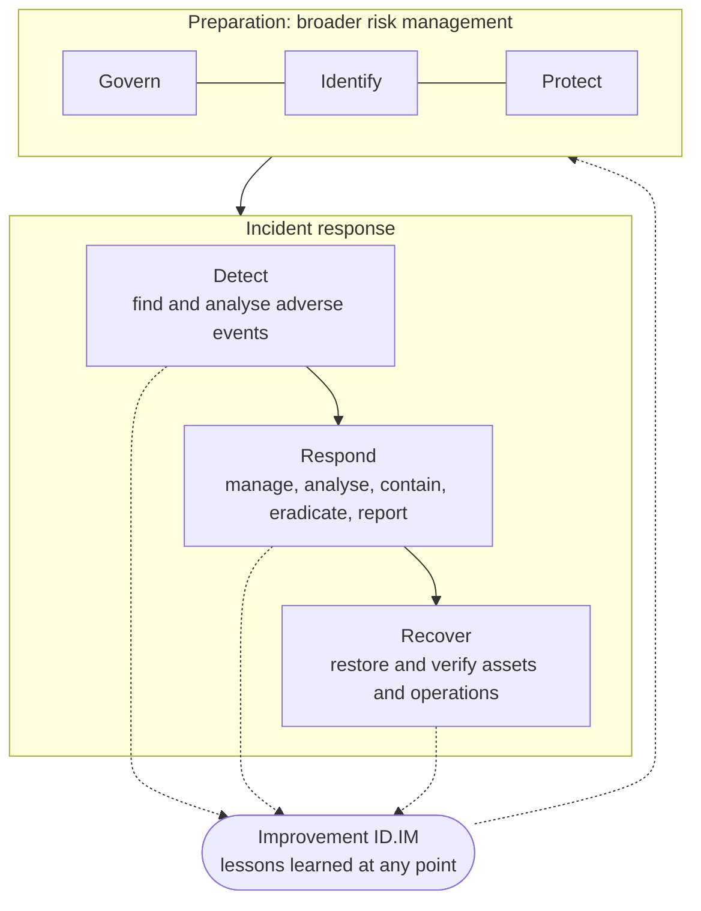

# Incident response life cycle

## NIST SP 800-61 Rev. 3 and CSF 2.0

In April 2025 NIST published SP 800-61 Rev. 3, *Incident Response Recommendations and Considerations for Cybersecurity Risk Management: A CSF 2.0 Community Profile*. It supersedes Rev. 2 (2012) and changes the point of view: incident response is no longer a separate cycle run by a separate team, but part of cybersecurity risk management, organised around the six functions of the NIST Cybersecurity Framework 2.0.

- **Govern, Identify, Protect** are preparation. They are not incident response as such, but they decide how well it goes: roles, policy, asset inventory, logging, backups, hardening.
- **Detect, Respond, Recover** are the incident response itself: finding and analysing adverse events, managing and containing the incident, restoring operations.
- **Improvement** (category ID.IM, inside Identify) runs across everything. Rev. 3 says lessons should be shared as soon as they are identified, not only after recovery has finished.

Rev. 3 maps the phases of the old model to CSF 2.0 functions (Table 1 of the publication):

| Rev. 2 phase | CSF 2.0 functions |
|---|---|
| Preparation | Govern, Identify (all categories), Protect |
| Detection & Analysis | Detect, Identify (Improvement) |
| Containment, Eradication & Recovery | Respond, Recover, Identify (Improvement) |
| Post-Incident Activity | Identify (Improvement) |

NIST is explicit that each organisation should use the life cycle model that suits it best. The playbooks in this repository follow the CSF structure for references and use the familiar operational phases for the actual steps.

## The classic model: PICERL

Many teams and training courses still use the six phases popularised by SANS: **Preparation, Identification, Containment, Eradication, Recovery, Lessons learned** (PICERL). It is close to the Rev. 2 cycle and works well as a checklist for a single incident, which is why each playbook here is laid out in that order.

Its weak point is the one Rev. 3 addresses: it suggests that incidents are rare and that improvement happens once, at the end. In practice, incidents overlap, recovery can take weeks, and a detection gap found on day one should be fixed on day one.

## How the playbooks map to CSF 2.0

| Playbook section | CSF 2.0 category | What it means in practice |
|---|---|---|
| Trigger and detection | DE.CM Continuous Monitoring, DE.AE Adverse Event Analysis | The alert or report that starts the process |
| Triage | RS.MA Incident Management | Reports are triaged and validated (RS.MA-02), categorised and prioritised (RS.MA-03), escalated as needed (RS.MA-04) |
| Evidence and analysis | RS.AN Incident Analysis | Establish what happened and the root cause, record actions, preserve data integrity |
| Containment, eradication | RS.MI Incident Mitigation | Incidents are contained (RS.MI-01) and eradicated (RS.MI-02) |
| Notifications | RS.CO Incident Response Reporting and Communication | Internal and external stakeholders, authorities |
| Recovery | RC.RP Incident Recovery Plan Execution, RC.CO Incident Recovery Communication | Criteria for starting recovery (RS.MA-05), verified backups, restored assets, end of recovery declared |
| Lessons learned | ID.IM Improvement | Corrective actions with owners and deadlines |

## Terms used in these pages

- **Event / adverse event**: something observable, possibly harmful. Most alerts are events that turn out to be benign.
- **Incident**: an event, confirmed by triage, that actually or imminently jeopardises confidentiality, integrity or availability. The moment someone declares an incident is also, in most cases, the moment the organisation "becomes aware" of it for GDPR and NIS2 purposes. Record that time.
- **Containment**: stop the damage from spreading without destroying evidence.
- **Eradication**: remove the attacker's access and persistence, and fix the weakness that let them in.
- **Recovery**: return systems to production in a known-good state and watch them.
