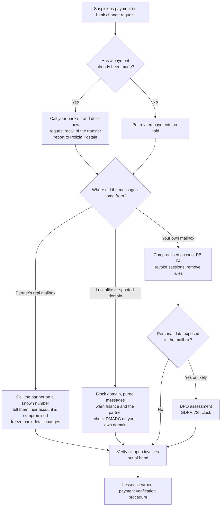

# Playbook: Business email compromise (BEC)

| Field | Value |
|---|---|
| ID | PB-03 |
| Default severity | SEV2; SEV1 if a large payment has already left |
| Owner | IR lead, with the finance manager |
| Often combined with | [Compromised account](compromised-account.md), [Phishing](phishing.md) |
| CSF 2.0 | DE.AE, RS.MA, RS.AN, RS.MI, RS.CO |

BEC is fraud carried out by email: a fake supplier sends new bank details, a fake CEO asks for an urgent transfer, a real supplier's hijacked mailbox continues an existing thread with a modified invoice. There is often no malware at all. The first hour decides whether the money comes back, so this playbook starts with finance, not with forensics.

## Trigger and detection

- Finance receives a request to change a supplier's IBAN, or an urgent and confidential payment request from an executive
- A supplier asks why an invoice is unpaid when it was paid, to a different account
- An employee notices a reply they did not write in a thread, or replies going to a slightly different domain
- Email security flags a lookalike domain (`examp1e.com`, `example-invoices.com`) or display name impersonation
- Identity alerts on a finance or executive mailbox (see [Compromised account](compromised-account.md))

## Triage (first 30 minutes)

1. **Has money left?** Amount, date and time, destination bank and IBAN, the payment reference. If yes, go straight to the bank step below, in parallel with everything else.
2. **Which variant is it?**
   - *Spoofed or lookalike domain*: your systems are not compromised, but someone is impersonating you or a partner.
   - *Your mailbox compromised*: the attacker is sending from a real internal account.
   - *Partner's mailbox compromised*: the fraudulent messages come from the supplier's real domain and pass SPF/DKIM/DMARC.
3. Who else received similar requests? Search mail for the same sender, domain, IBAN, subject or attachment.
4. Are other payments to the same supplier scheduled?

## Decision flow

## Containment

**Finance and bank (minutes count)**

- Call your bank's fraud or payments desk by phone, give the transaction details and ask for a recall. Follow up in writing. The bank will often ask for a police report: file it with the Polizia Postale as soon as possible.
- Put on hold every pending payment to the supplier or beneficiary involved, and any bank detail change received in the last weeks.
- Verify the request with the real person or supplier **through a channel you already had**: the phone number in your supplier master data or on an old contract, never the one in the suspicious email or its signature.

**Email**

- Purge the fraudulent messages from all mailboxes and block lookalike domains on the gateway.
- If your own mailbox was used: revoke sessions and refresh tokens, reset the password, remove unknown MFA methods, forwarding and mailbox rules. Attackers typically create rules that move replies from the bank or the supplier to an obscure folder (RSS Feeds, Archive) so the real owner does not see them.
- If the partner's mailbox was used: tell them by phone, and treat every message from that domain as untrusted until they confirm they have cleaned up.

## Evidence to collect

- The complete thread with full headers, including the legitimate messages that preceded the fraudulent ones
- Payment records: order, approvals, transfer confirmation, the fraudulent IBAN and beneficiary name
- Mailbox audit logs of affected internal accounts: sign-ins, rule creation, message access (`MailItemsAccessed` in Microsoft 365 where available), sent items
- Registration details (WHOIS, creation date) of lookalike domains
- The police report number and the bank's recall reference

## Eradication

- Remove attacker rules, forwarding, OAuth consents and devices from compromised internal mailboxes; confirm with a second check a day later.
- Check whether the attacker used the mailbox to send fraudulent requests to *your* customers. If so, warn them.
- Take down or report lookalike domains that impersonate your brand.

## Recovery

- Resume payments to the supplier only after bank details have been confirmed through a known channel and recorded by someone other than the requester.
- Introduce or enforce a rule: any change of bank details or any urgent payment outside the normal flow requires a call-back to a known number and a second approver.
- Check that your domain publishes SPF, DKIM and a DMARC policy with enforcement (`p=quarantine` or `p=reject`), so that direct spoofing of your domain is blocked.

## Notifications

- **Law enforcement**: a report to the Polizia Postale supports the bank recall and the insurance claim.
- **GDPR**: if an internal mailbox was accessed, it probably contained personal data (customers, employees, suppliers' contacts). The DPO assesses the risk.
- **Partners and customers**: if they received fraudulent requests in your name, tell them what to ignore and how to verify.

## Lessons learned

- Which control should have stopped the payment (call-back, dual approval) and why did it not?
- How long between the fraudulent request and the payment? Between the payment and the bank call?
- Did anyone notice warning signs (urgency, secrecy, new IBAN in a different country) and feel unable to question an executive?

## Mistakes to avoid

- Replying to the fraudulent thread to "verify": you are talking to the attacker.
- Using phone numbers or links from the suspicious email.
- Waiting for the IT investigation before calling the bank.
- Blaming the finance employee in front of colleagues; the next attempt will then not be reported.
- Assuming a message is genuine because it passes DMARC: it only proves the domain is real, and the partner's real mailbox may be the compromised one.

## ATT&CK techniques

IDs checked against MITRE ATT&CK Enterprise v19.2.

| ID | Technique | Where you see it |
|---|---|---|
| T1684.001 | Impersonation | Posing as an executive or supplier |
| T1586.002 | Compromise Accounts: Email Accounts | Hijacked internal or partner mailbox |
| T1585.002 | Establish Accounts: Email Accounts | Free-mail or new accounts posing as the supplier |
| T1583.001 | Acquire Infrastructure: Domains | Lookalike domains |
| T1114.002 / T1114.003 | Remote Email Collection / Email Forwarding Rule | Reading the victim's mail to time the fraud |
| T1564.008 | Email Hiding Rules | Hiding replies from the bank or supplier |
| T1657 | Financial Theft | The fraudulent transfer |

## Checklist

- [ ] Payment status established (amount, time, IBAN, bank)
- [ ] Bank fraud desk called and recall requested (if paid)
- [ ] Report filed with the Polizia Postale (if paid or attempted fraud)
- [ ] Related pending payments and bank changes on hold
- [ ] Variant identified: lookalike domain, own mailbox, partner mailbox
- [ ] Fraudulent messages purged, domains blocked
- [ ] Compromised internal mailboxes handled with PB-04
- [ ] Partner informed by phone on a known number
- [ ] Open invoices verified out of band
- [ ] DPO informed if an internal mailbox was accessed
- [ ] Payment verification procedure reviewed
