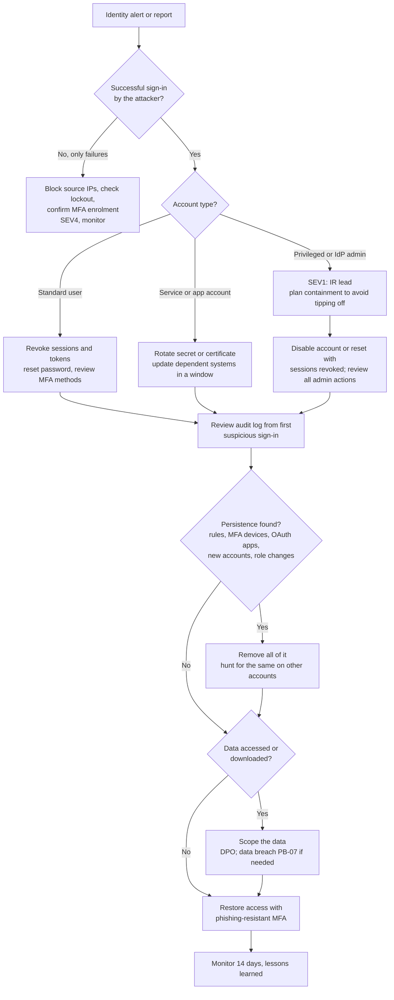

# Playbook: Compromised account or credentials

| Field | Value |
|---|---|
| ID | PB-04 |
| Default severity | SEV2 for a standard user with confirmed attacker access; SEV1 for privileged, identity provider or service accounts |
| Owner | SOC lead; IR lead for privileged accounts |
| Often combined with | [Phishing](phishing.md), [BEC](bec.md), [Data breach](data-breach.md) |
| CSF 2.0 | DE.CM, DE.AE, RS.MA, RS.AN, RS.MI, RC.RP |

A valid account is the quietest way into an organisation: no malware, logins that look normal, access to exactly what the user can reach. This playbook covers user, privileged and service accounts in on-premises Active Directory and in cloud identity providers (Entra ID, Google Workspace, Okta), and credentials found in a leak.

## Trigger and detection

- Identity protection alerts: impossible travel, sign-in from anonymising infrastructure, unfamiliar sign-in properties, leaked credentials
- Many MFA push requests to one user (MFA fatigue), or the user reporting a prompt they did not start
- Password spraying or credential stuffing patterns: many accounts, few attempts each, from the same sources
- New MFA method or device registered, especially right after a risky sign-in
- Account activity outside the user's normal pattern: mass downloads, new mailbox rules, access to new applications, role changes
- Threat intelligence or a third party reporting corporate credentials in a stealer log or a paste

## Triage (first 30 minutes)

1. **Which account type?** Standard user, privileged (domain admin, Global Admin, cloud subscription owner), service or application account, external or guest. Privileged and service accounts go to SEV1.
2. **Is there evidence of successful attacker access?** Look for successful sign-ins from the suspicious source, not just failures. Check whether MFA was satisfied and how (push approval, SMS, token replay with no MFA prompt at all).
3. **Since when?** Find the first suspicious sign-in. Everything after that moment is in scope.
4. **What did the attacker do?** Audit logs: files and mail accessed, rules created, MFA methods added, OAuth consents, role or group changes, new accounts or app credentials, password resets on other accounts.
5. **Is it only one account?** Search the same IPs, user agents and ASNs across all sign-in logs.

## Decision flow

## Containment

**Standard user**

- Revoke all sessions and refresh tokens, then reset the password. Doing it the other way round leaves stolen sessions alive for a while.
- Remove MFA methods and devices the user does not recognise, then have them re-register in front of the service desk or through a verified process.
- Remove mailbox rules, forwarding, delegates and OAuth consents added by the attacker.
- Block the attacker's IPs if they are stable, knowing that most attackers rotate through residential proxies.

**Privileged account**

- Decide with the IR lead whether to act at once or observe briefly to understand scope. An attacker with admin rights who sees their account disabled may use another one you have not found yet. In most cases act at once; delaying requires a documented reason.
- Disable the account or reset it with sessions revoked, from a clean admin workstation.
- Review every administrative action since the first suspicious sign-in: new accounts, role assignments, conditional access or federation changes, new app registrations or credentials, mailbox permissions, EDR or logging configuration changes.
- In Active Directory, a compromised domain admin usually means resetting all privileged credentials and `krbtgt` twice (see [Ransomware](ransomware.md), Eradication).

**Service or application account**

- Rotate the password, secret or certificate and update the systems that use it. Plan the change: rotating blindly can stop production.
- Restrict where the account may sign in from (conditional access, logon restrictions) if that was not already done.

## Evidence to collect

- Identity provider sign-in logs for the account and for the attacker's IPs across the tenant
- Audit logs (directory changes, role assignments, app consents, MFA registration)
- Mailbox audit and file access logs (SharePoint, OneDrive, Google Drive, file servers) for the compromise window
- Domain controller events for on-premises accounts (logons, Kerberos ticket requests, group changes)
- The source of the leak if known (stealer log entry, paste, phishing kit URL) and the infected device, if the credentials came from malware

## Eradication

- Confirm that all persistence is gone: MFA devices, app passwords, OAuth grants, app registrations with new secrets, added roles, forwarding, new accounts.
- If credentials came from an infostealer on a personal or corporate device, that device is compromised too: clean or reimage it and reset every credential stored in its browser.
- Look for the same indicators on other accounts; spraying campaigns rarely succeed only once.

## Recovery

- Give access back only with phishing-resistant MFA where possible, or at least number matching on push notifications.
- Monitor the account for 14 days for new risky sign-ins or configuration changes.
- For privileged accounts, check that the admin model is sound before closing: separate admin accounts, no admin use from workstations, just-in-time elevation where available.

## Notifications

Involve the DPO whenever the attacker accessed data: a mailbox, a CRM, an HR system. For a privileged account in a NIS2 entity, consider whether the compromise is a significant incident even before any data loss is confirmed. See [regulatory obligations](../regulatory.md).

## Lessons learned

- How were the credentials obtained (phishing, reuse from another breach, infostealer, spraying)?
- Why did MFA not stop it: not enrolled, fatigue, legacy protocol without MFA, AiTM token theft?
- Would a conditional access policy (compliant device, location, sign-in risk) have blocked the sign-in?

## Mistakes to avoid

- Resetting the password without revoking sessions and refresh tokens.
- Letting the user re-register MFA through a process the attacker can also complete.
- Warning the user by email when the mailbox is the compromised asset.
- Rotating a service account secret without knowing what depends on it and causing an outage.
- Stopping at the first account instead of searching for the same attacker infrastructure across the tenant.

## ATT&CK techniques

IDs checked against MITRE ATT&CK Enterprise v19.2.

| ID | Technique | Where you see it |
|---|---|---|
| T1078.002 / T1078.004 | Valid Accounts: Domain Accounts / Cloud Accounts | Sign-in with stolen credentials |
| T1110.003 | Password Spraying | Few attempts across many accounts |
| T1110.004 | Credential Stuffing | Credentials reused from other breaches |
| T1621 | Multi-Factor Authentication Request Generation | MFA fatigue |
| T1111 | Multi-Factor Authentication Interception | Capture of OTP codes |
| T1539 | Steal Web Session Cookie | Token theft bypassing MFA |
| T1098.005 | Device Registration | Attacker adds their own MFA device |
| T1098.001 / T1098.003 | Additional Cloud Credentials / Additional Cloud Roles | Persistence through app secrets or role assignment |
| T1136.003 | Create Account: Cloud Account | New account created as a backdoor |
| T1550.001 | Application Access Token | Use of stolen OAuth tokens |

## Checklist

- [ ] Account type and severity set
- [ ] First suspicious sign-in identified
- [ ] Sessions and refresh tokens revoked, then password reset
- [ ] MFA methods and devices reviewed and cleaned
- [ ] Mailbox rules, forwarding, delegates, OAuth consents reviewed
- [ ] Admin actions since first suspicious sign-in reviewed (privileged accounts)
- [ ] Attacker IPs and user agents searched across the tenant
- [ ] Source of the credentials identified; infected device handled
- [ ] Data accessed scoped; DPO informed if relevant
- [ ] Access restored with strong MFA, 14-day monitoring set
