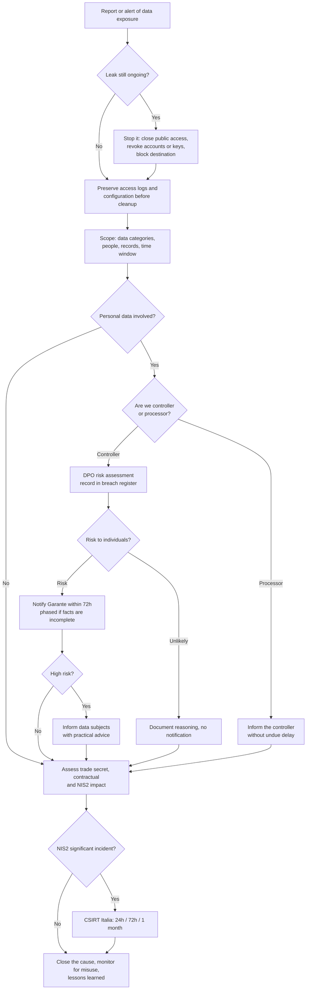

# Playbook: Data breach and exfiltration

| Field | Value |
|---|---|
| ID | PB-07 |
| Default severity | SEV1 for sensitive or large-scale personal data, secrets or regulated data; SEV2 otherwise |
| Owner | IR lead, with the DPO |
| Often combined with | [Ransomware](ransomware.md), [Compromised account](compromised-account.md) |
| CSF 2.0 | DE.AE, RS.MA, RS.AN, RS.MI, RS.CO, RC.CO |

In a data breach the technical containment is often quick (close the bucket, revoke the account) and the hard part is answering, with evidence, what data left, whose it was and how much. Those answers drive the GDPR decisions, and the GDPR clock does not wait for a complete forensic report. The order here is: stop the leak, preserve the evidence, scope, assess risk, notify.

## Trigger and detection

Breaches are often reported by someone outside the organisation. Typical sources:

- DLP or CASB alert: large uploads to personal cloud storage, mass downloads from SharePoint or a CRM
- Network alert: unusual outbound volume, long-running connections to unknown hosts, use of tools such as rclone
- Threat intelligence: company data on a leak site or a criminal forum
- A security researcher reporting an exposed database, bucket or backup file
- A customer or partner who received their own data from a third party, or phishing that uses details only you had
- A supplier telling you they were breached and your data was in scope
- Loss or theft of an unencrypted laptop or removable media

## Triage (first hour)

1. **Is the leak still open?** A public bucket, an active attacker session, a sync job still running.
2. **What data?** Categories (identifiers, contact details, financial, health, credentials, special categories under art. 9 GDPR, trade secrets), systems and files involved.
3. **Whose and how many?** Customers, employees, minors; approximate number of people and records. A range is fine at this stage.
4. **When?** First and last evidence of access or transfer. Log retention may limit what you can prove.
5. **Protected?** Were the files encrypted with a key the attacker does not have? Were passwords stored with a strong hashing algorithm?
6. **Who is the controller?** If you process the data on behalf of a customer, you must inform them without undue delay; they decide on notifications.

Record the time the incident was declared: it is likely your moment of "awareness" for GDPR and NIS2.

## Decision flow

## Containment

- Close the exposure: remove public access from the bucket or share, disable the anonymous link, take the vulnerable application offline or put it behind authentication.
- Revoke the credentials used: user sessions, API keys, access keys, OAuth tokens, service account secrets.
- Block exfiltration destinations (cloud storage accounts, IPs, domains) at the proxy and firewall.
- **Before changing configurations, capture them**: bucket policy and ACL, sharing settings, access logs. Deleting the exposed resource can delete the only proof of who accessed it.
- If a supplier was breached, restrict their access to your systems until you know the scope.

## Evidence to collect

- Access logs for the exposed resource (cloud storage server access logs, CloudTrail data events, SharePoint/OneDrive audit, database audit)
- Egress evidence: proxy, firewall, DLP, flow data; EDR telemetry of archiving tools and upload utilities
- A copy of the data as it was exposed, or a precise inventory of it, to support the scoping (store it securely; it is itself sensitive)
- Screenshots and URLs of leak site posts, with date and time, collected from an isolated environment
- The researcher's or third party's report, with all correspondence

## Eradication

- Fix the root cause: misconfiguration, vulnerability, excessive permissions, missing MFA, a process that exported data to an unprotected location.
- Check that the attacker has no remaining access (see [Compromised account](compromised-account.md) and [Ransomware](ransomware.md) for persistence checks).
- Search for other copies of the same data in similar locations (other buckets with the same naming, other shares with "anyone with the link").

## Recovery

- Restore the service with the corrected configuration and a review by someone who did not make the original change.
- Reset credentials of affected people if passwords or tokens were in the data, and tell them.
- Monitor for misuse: phishing campaigns using the leaked data, fraud attempts, credential stuffing against your login pages.

## Notifications

This is the playbook where notifications matter most. Use the [regulatory obligations](../regulatory.md) page and the [notification template](../templates/authority-notification.md).

- **Garante (art. 33 GDPR)**: within 72 hours of awareness if the breach is likely to result in a risk; phased information is allowed.
- **Data subjects (art. 34)**: without undue delay if the risk is high. Tell them what happened, what data, what you did and what they can do (change passwords, watch for phishing, contact point).
- **Controller**: if you are a processor, inform the customer without undue delay.
- **CSIRT Italia**: if you are a NIS2 entity and the incident is significant.
- **Law enforcement**: theft of data and extortion are crimes; report to the Polizia Postale.

## Lessons learned

- How was the breach discovered, and how long after it started? Would internal monitoring have caught it?
- Were the logs sufficient to prove what was and was not accessed? If not, which retention or logging level must change?
- Why was the data there at all? Data minimisation is the cheapest control.

## Mistakes to avoid

- Deleting the exposed bucket or share before capturing access logs and configuration.
- Waiting for complete certainty before involving the DPO, and missing the 72-hour window.
- Giving a precise number of affected people too early and having to correct it upwards publicly.
- Contacting the attacker or buying the data back without legal and management approval.
- Downloading leaked data from criminal sites on corporate machines.
- Forgetting the breach register: breaches that are not notified must still be documented.

## ATT&CK techniques

IDs checked against MITRE ATT&CK Enterprise v19.2.

| ID | Technique | Where you see it |
|---|---|---|
| T1530 | Data from Cloud Storage | Access to buckets, blobs, cloud drives |
| T1213 | Data from Information Repositories | SharePoint, Confluence, CRM exports |
| T1039 | Data from Network Shared Drive | Mass copy from file servers |
| T1074 | Data Staged | Collection in a temporary folder before transfer |
| T1560.001 | Archive via Utility | 7-Zip, WinRAR archives before exfiltration |
| T1567.002 | Exfiltration to Cloud Storage | rclone or browser uploads to MEGA, Dropbox and similar |
| T1041 | Exfiltration Over C2 Channel | Data sent through the malware's channel |
| T1048 | Exfiltration Over Alternative Protocol | FTP, DNS, other protocols |
| T1537 | Transfer Data to Cloud Account | Copy to an attacker-controlled cloud account |

## Checklist

- [ ] Leak stopped; configuration and access logs captured first
- [ ] Credentials and keys involved revoked
- [ ] Data categories, number of people and records, time window estimated
- [ ] Controller or processor role clarified
- [ ] DPO risk assessment done and recorded in the breach register
- [ ] Garante notification sent within 72h, or reasoning for not notifying documented
- [ ] Data subjects informed if high risk
- [ ] NIS2 significance assessed
- [ ] Root cause fixed, other copies searched
- [ ] Monitoring for misuse of the leaked data in place
