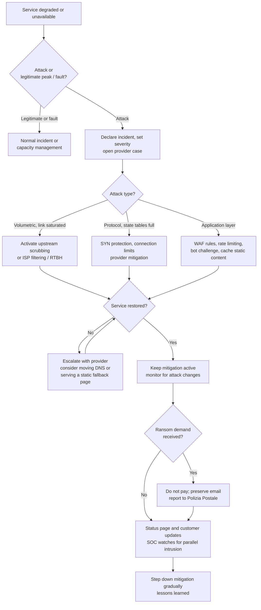

# Playbook: DDoS

| Field | Value |
|---|---|
| ID | PB-06 |
| Default severity | SEV2; SEV1 if a critical or regulated service is down |
| Owner | IR lead, with network operations |
| CSF 2.0 | DE.CM, DE.AE, RS.MA, RS.MI, RS.CO, RC.RP, RC.CO |

Most of the DDoS response is decided before the attack: whether you have an upstream scrubbing service or a CDN in front of your applications, whether DNS can be switched quickly, whether you know who to call at your provider. During the attack, the team's job is to recognise the type of attack, activate the right protection and keep customers informed. Blocking source IPs one by one does not work against a botnet or a reflection attack, and scaling up servers in the cloud can turn a DDoS into a large bill.

## Before an attack (prerequisites)

Check that these exist, because the playbook depends on them:

- A DDoS protection service (from the ISP, a scrubbing provider or a CDN/WAF) with a contract, a documented activation procedure and a 24/7 contact
- Public services reachable through that protection, or DNS records with a short TTL so they can be moved
- Baselines of normal traffic (bits per second, packets per second, requests per second) for the main services
- Rate limiting and bot protection rules ready to switch on at the WAF or load balancer
- A status page hosted outside your own infrastructure
- Cloud budget alerts, so auto-scaling during an attack does not go unnoticed

## Trigger and detection

- Monitoring alerts: service unavailable, latency spikes, link saturation, firewall or load balancer session tables full
- Provider notification of an attack in progress
- Traffic anomalies: huge volume from many sources, spikes of UDP from ports 53, 123, 11211 or 1900 (typical reflection sources), floods of HTTP requests to a single expensive endpoint
- An email demanding payment to stop or avoid an attack (ransom DDoS)

## Triage (first 15 minutes)

1. **Is it an attack?** Rule out a legitimate traffic peak (a marketing campaign, a news mention), a failed deployment or a provider outage.
2. **What type?**
   - *Volumetric* (UDP floods, reflection/amplification): saturates the link; only upstream filtering helps.
   - *Protocol* (SYN floods, fragmented packets): exhausts firewall or load balancer state tables.
   - *Application layer* (HTTP floods, slow requests, expensive searches or logins): looks like real users; needs WAF rules, rate limiting and bot challenges.
3. **What is affected?** Which services, which customers, and whether other services share the same link or firewall.
4. **Is anything else happening?** A DDoS can be a distraction. Ask the SOC to watch for intrusion attempts, account takeover or fraud during the attack.

## Decision flow

## Containment

- Open a priority case with the ISP or DDoS protection provider and give them the target IPs, ports, start time and observed traffic profile.
- **Volumetric**: have the provider filter upstream. As a last resort, remotely triggered black hole (RTBH) routing on the attacked IP stops the flood from taking down everything else, but it also takes the target offline; it is a business decision.
- **Protocol**: enable SYN cookies or equivalent protection, lower timeouts, apply connection limits per source.
- **Application layer**: enable rate limiting on the targeted endpoints, turn on JavaScript or CAPTCHA challenges for suspicious clients, cache what can be cached, temporarily disable expensive functions (full-text search, report generation) if they are the target.
- Geo-blocking can help if your customers are all in one region, but it also blocks real users travelling or using VPNs; decide consciously and write it down.
- **Do not simply scale up** cloud resources without a limit. It may keep the site up for a while at a cost the attacker does not pay.

## Evidence to collect

- Flow data (NetFlow, sFlow, IPFIX) and samples of packet captures during the attack
- Firewall, load balancer, WAF and CDN logs, with the provider's attack report
- Timeline: start, peak values (Gbps, Mpps, requests per second), changes in vector, mitigation actions and their effect
- Any ransom or extortion message, with full headers

## Eradication

There is nothing to remove from your systems in a pure DDoS. The work is to close what made the attack effective: origin servers reachable directly from the internet bypassing the CDN, services exposed that did not need to be (open DNS resolvers, NTP, memcached, which also make you a reflector for others), missing rate limits.

## Recovery

- Step down mitigation gradually and watch whether the attack resumes; many attacks come in waves.
- Confirm that all services, including the ones sharing infrastructure with the target, work normally.
- Check the cloud bill and ask the provider about credits for attack-related usage where the contract allows it.

## Notifications

- Customers: publish updates on the status page and through support channels. Say what is affected and when the next update will come; do not speculate on who is behind it.
- NIS2: for essential and important entities, a prolonged outage of a service can be a significant incident. Assess it early; the 24-hour clock applies. See [regulatory obligations](../regulatory.md).
- Law enforcement: report extortion attempts to the Polizia Postale.

## Lessons learned

- How long between the start of the attack and the activation of mitigation? Where was time lost (detection, provider contact, approvals)?
- Did the provider's protection cover all the attacked services, or were some left outside?
- Did the status page and customer communication work?

## Mistakes to avoid

- Trying to block attacking IPs manually, one by one.
- Paying a ransom DDoS demand: it marks you as a paying target.
- Scaling cloud capacity without a cap.
- Focusing only on the outage and missing an intrusion attempt running at the same time.
- Discovering during the attack that the protection contract, the provider contact or the DNS access credentials are missing.

## ATT&CK techniques

IDs checked against MITRE ATT&CK Enterprise v19.2.

| ID | Technique | Where you see it |
|---|---|---|
| T1498 | Network Denial of Service | Floods aimed at bandwidth |
| T1498.001 | Direct Network Flood | UDP, ICMP, SYN floods from a botnet |
| T1498.002 | Reflection Amplification | Spoofed requests to DNS, NTP, memcached, CLDAP reflectors |
| T1499 | Endpoint Denial of Service | Attacks on the service rather than the link |
| T1499.002 | Service Exhaustion Flood | HTTP floods, TLS renegotiation abuse |
| T1499.003 | Application Exhaustion Flood | Requests to expensive functions (search, login) |

## Checklist

- [ ] Attack confirmed, legitimate peak or fault ruled out
- [ ] Attack type identified (volumetric, protocol, application)
- [ ] Provider case opened, mitigation activated
- [ ] WAF, rate limiting, bot challenges applied for application attacks
- [ ] Cloud scaling capped, budget monitored
- [ ] SOC watching for parallel intrusion or fraud
- [ ] Status page and customer updates published
- [ ] Ransom demand preserved and reported, not paid
- [ ] NIS2 significance assessed
- [ ] Flow data, logs and provider report collected
- [ ] Mitigation stepped down gradually, services verified
