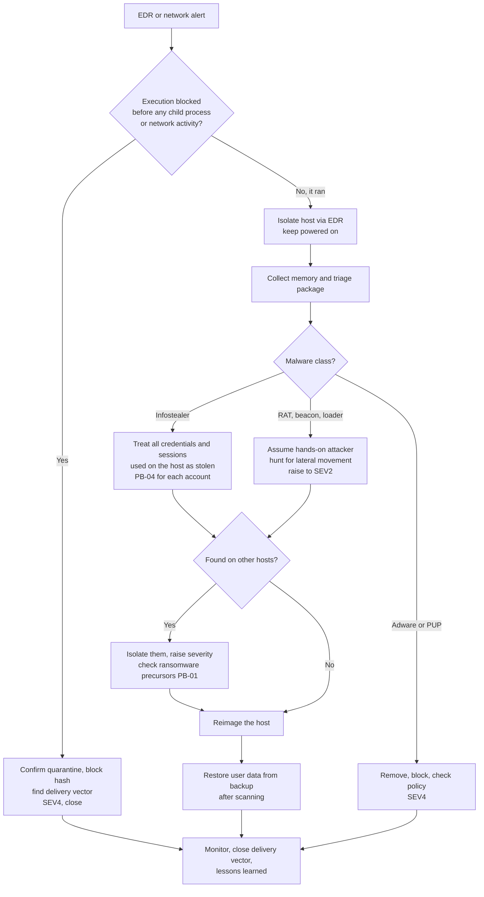

# Playbook: Malware on an endpoint

| Field | Value |
|---|---|
| ID | PB-05 |
| Default severity | SEV3; SEV2 if it is a server, an admin workstation or an infostealer; SEV1 if it spreads |
| Owner | SOC lead |
| Often combined with | [Phishing](phishing.md), [Compromised account](compromised-account.md), [Ransomware](ransomware.md) |
| CSF 2.0 | DE.CM, DE.AE, RS.MA, RS.AN, RS.MI, RC.RP |

The question is not only "is it gone?" but "what could it do while it was running?". A loader blocked at the first stage is a short ticket. An infostealer that ran for six hours has probably sent every saved browser password and session cookie to its operator, and the real incident is the accounts, not the laptop.

## Trigger and detection

- EDR or antivirus detection, especially when the action was "detected" rather than "blocked"
- Suspicious behaviour: Office spawning PowerShell or `cmd.exe`, encoded commands, LOLBins (`mshta`, `rundll32`, `regsvr32`, `certutil`) downloading files
- Network alert: beaconing to a known C2 domain or IP, DNS requests to a newly registered domain
- User report: pop-ups, a document that "did nothing" when opened, a fake update page

## Triage (first 30 minutes)

1. **Was execution blocked or did the code run?** Check the EDR process tree: parent process, command line, child processes, network connections, files written.
2. **What is it?** Hash lookup in threat intelligence, family name from the EDR, sandbox report. Classify: adware or PUP, loader or dropper, infostealer, remote access trojan, ransomware precursor (Cobalt Strike or similar beacon).
3. **Whose machine?** Standard user, admin, developer with production keys, finance, server.
4. **How did it arrive?** Email attachment, download, USB, exploited service, software update.
5. **Is it elsewhere?** Search the whole fleet in the EDR for the hash, file name, C2 domain and command line pattern.

## Decision flow

## Containment

- **Isolate the host through the EDR** (network containment keeps the EDR channel open so you can still investigate). Do not shut it down.
- Block the hash, the C2 domains and IPs on EDR, proxy, DNS filter and firewall.
- If the malware is an infostealer, contain the accounts, not just the device: revoke sessions and reset passwords for every account the user signed into from that browser, including SaaS and personal accounts used on the corporate device. Follow [Compromised account](compromised-account.md).
- If it is a remote access tool or C2 beacon, assume an operator is active. Check for lateral movement from the host (RDP, SMB, WMI, PsExec) and for credential dumping.

## Evidence to collect

- Memory image before any remediation
- EDR triage package or a Velociraptor/KAPE collection: process list, network connections, autoruns, scheduled tasks, services, prefetch, event logs, browser history
- The sample (from quarantine) stored in a password-protected archive, with its hash
- The delivery artefact: email, download URL, USB device details
- Proxy and DNS logs for the host during the infection window

## Eradication

- **Reimage the host** for anything beyond adware or an execution blocked at the first stage. Removing the files the AV knows about does not remove persistence it does not know about, and you cannot prove the machine is clean.
- Before reimaging, record the persistence you found (Run keys, scheduled tasks, services, WMI subscriptions, startup folder). Use it to hunt on other hosts.
- Close the delivery vector: block the file type at the email gateway, remove local admin rights, patch the exploited application, block macros from the internet.

## Recovery

- Reinstall from the standard image, apply updates, re-enrol in EDR and management tools before handing it back.
- Restore user files from backup or cloud sync, scanned, from before the infection time. Do not copy back executables or scripts from the infected disk.
- Watch the user's accounts and the new device for two weeks.

## Notifications

Usually internal only. It becomes a notification question if the malware gave access to personal data (an infostealer on an HR or customer service workstation, a RAT on a file server) or if it disrupted an essential service. See [regulatory obligations](../regulatory.md).

## Lessons learned

- Why did it run: missing ASR rule, user with local admin, unblocked file type, EDR in audit mode?
- How long between execution and isolation?
- If it was an infostealer: were corporate passwords saved in the browser? Is a password manager available and used?

## Mistakes to avoid

- "Cleaning" the machine with an AV scan and returning it to the user.
- Reimaging before collecting memory and triage data, and then not knowing what the malware did.
- Handling an infostealer as a device problem and forgetting the stolen credentials and sessions.
- Uploading the sample to a public sandbox when it may contain internal data (documents with embedded macros often do).
- Logging in to the infected host with a domain admin account.

## ATT&CK techniques

IDs checked against MITRE ATT&CK Enterprise v19.2.

| ID | Technique | Where you see it |
|---|---|---|
| T1204.002 | User Execution: Malicious File | The user opens the attachment or download |
| T1059.001 | PowerShell | Download cradles, encoded commands |
| T1027 | Obfuscated Files or Information | Packed or encoded payloads |
| T1105 | Ingress Tool Transfer | Second-stage download |
| T1071.001 | Application Layer Protocol: Web Protocols | C2 over HTTPS |
| T1547.001 | Registry Run Keys / Startup Folder | Persistence at logon |
| T1053.005 | Scheduled Task | Persistence and execution |
| T1543.003 | Windows Service | Persistence as a service |
| T1003.001 | LSASS Memory | Credential dumping by an operator |
| T1539 | Steal Web Session Cookie | Infostealers taking browser sessions |
| T1685 | Disable or Modify Tools | Attempts to disable EDR or AV |

## Checklist

- [ ] Execution status confirmed (blocked or ran)
- [ ] Host isolated through EDR, still powered on
- [ ] Memory and triage package collected, sample preserved with hash
- [ ] Malware class identified
- [ ] Hash, domains, IPs blocked
- [ ] Fleet-wide hunt for IOCs completed
- [ ] Infostealer: all accounts used on the host handled with PB-04
- [ ] Persistence documented, host reimaged
- [ ] User data restored from a clean point
- [ ] Delivery vector closed
