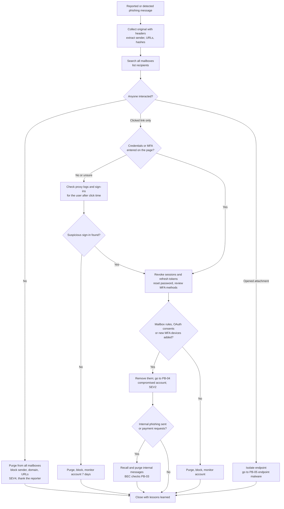

# Playbook: Phishing

| Field | Value |
|---|---|
| ID | PB-02 |
| Default severity | SEV4 if nobody interacted, SEV3 if someone clicked, SEV2 if credentials or tokens were captured or a payload ran |
| Owner | SOC lead |
| Often combined with | [Compromised account](compromised-account.md), [Endpoint malware](endpoint-malware.md), [BEC](bec.md) |
| CSF 2.0 | DE.AE, RS.MA, RS.AN, RS.MI, RS.CO |

Most phishing incidents are small. The work is to find out quickly whether this one is: who received the message, who clicked, who typed a password or ran an attachment, and whether the attacker already used what they got. Adversary-in-the-middle (AiTM) kits steal the session cookie after the victim completes MFA, so "the user has MFA" does not close the case.

## Trigger and detection

- A user reports a message (report button, forward to the SOC mailbox)
- Email security alert: malicious URL or attachment detected after delivery, impersonation of an executive or supplier
- Proxy or DNS alert: connection to a newly registered or known phishing domain
- Identity provider alert: sign-in from an unusual location or infrastructure shortly after a click, a new MFA method registered

## Triage (first 30 minutes)

1. Get the original message with full headers (not a forward from the user's client, which strips them). Note sender, return-path, reply-to, sending IP, SPF/DKIM/DMARC results, URLs, attachment hashes.
2. Determine the type: credential harvesting link, malicious attachment, callback phishing (asks the victim to call a number), QR code, or pure pretext leading to BEC.
3. Find every recipient: search the mail platform by sender, subject, URL and attachment hash. Campaigns rarely hit one person.
4. Find who interacted: clicks in the email security gateway, proxy and DNS logs for the phishing domain, attachment execution on endpoints (EDR).
5. For each user who clicked a credential page: check sign-in logs for successful authentications from unfamiliar IPs or ASNs after the click time.

## Decision flow

## Containment

- **Search and purge** the message from every mailbox, including those of users who have not reported it (Microsoft 365: Threat Explorer or Content Search with purge; Google Workspace: security investigation tool). Keep one copy in the evidence store.
- **Block** the sender address or domain, the URLs and the attachment hashes on the email gateway, the proxy or DNS filter and the EDR. For lookalike domains, block the domain, not just the address.
- For users who entered credentials or approved an MFA prompt:
  - **Revoke all sessions and refresh tokens** first (Entra ID: *Revoke sessions*, or `revokeSignInSessions` through Microsoft Graph; Google Workspace: sign out the user and reset sign-in cookies). A password reset alone does not invalidate a stolen session cookie.
  - Reset the password.
  - Review the registered MFA methods and devices; remove anything the user does not recognise.
  - Check mailbox rules (forwarding, move-to-folder, delete), forwarding settings and delegates.
  - Check OAuth applications the user consented to recently; revoke unknown ones.
- If the attachment was opened, isolate the endpoint through the EDR and follow the [endpoint malware](endpoint-malware.md) playbook.

## Evidence to collect

- Original message in `.eml` or `.msg` format with headers
- List of recipients, list of users who clicked and when (gateway, proxy, DNS logs)
- The phishing page: URL, screenshot, hosting details, taken from an isolated analysis browser or a URL scanning service
- Attachment hash and sandbox report (submit hashes publicly, not files that may contain internal data)
- Sign-in and audit logs of affected accounts from the click time onwards: IP, user agent, MFA details, new devices, mailbox and consent changes

## Eradication

- Confirm that no mailbox rules, forwarding, delegates, OAuth grants or MFA methods added by the attacker remain.
- If the attacker sent emails from the compromised account, identify the recipients (internal and external) and warn them.
- Report the phishing domain to the registrar or hosting provider and, if it impersonates your brand, to the relevant anti-abuse services.

## Recovery

- Users regain access with a new password and verified MFA methods. Move them to phishing-resistant MFA (FIDO2 security keys, passkeys, certificate-based) where possible; this is the control that stops AiTM kits.
- Monitor affected accounts for seven days for new sign-in anomalies.
- Tell the reporter what happened. People keep reporting when they see it made a difference.

## Notifications

A phishing incident becomes a notification question when the attacker accessed a mailbox or a document store with personal data. Involve the DPO as soon as a sign-in by the attacker is confirmed; mailboxes almost always contain personal data. See [regulatory obligations](../regulatory.md).

## Lessons learned

- How long between delivery and the first user report? Between report and purge?
- Why did the email gateway let it through (new domain, legitimate hosting service, QR code, passed DMARC because it came from a compromised partner)?
- Did conditional access policies (compliant device, trusted locations) limit what the attacker could do with the stolen session?

## Mistakes to avoid

- Resetting the password and considering the account safe: sessions and refresh tokens stolen through AiTM keep working until revoked.
- Purging only the mailbox of the user who reported the message.
- Opening the phishing link from a normal corporate workstation to "have a look".
- Blaming the user who clicked: the next time they will not report.
- Blocking only the display name or a single sender address: attackers change both in seconds. Block the domain and the URLs.

## ATT&CK techniques

IDs checked against MITRE ATT&CK Enterprise v19.2.

| ID | Technique | Where you see it |
|---|---|---|
| T1566.001 | Spearphishing Attachment | Malicious document or archive |
| T1566.002 | Spearphishing Link | Credential harvesting page |
| T1566.003 | Spearphishing via Service | Message through Teams, LinkedIn or similar |
| T1204.001 / T1204.002 | Malicious Link / Malicious File | The user click or execution |
| T1557 | Adversary-in-the-Middle | AiTM proxy kits that relay the login and MFA |
| T1539 | Steal Web Session Cookie | Session cookie captured after MFA |
| T1550.004 | Web Session Cookie | Replay of the stolen cookie |
| T1114.003 | Email Forwarding Rule | Forwarding to an external address |
| T1564.008 | Email Hiding Rules | Rules that hide replies or security notices |
| T1098.005 | Device Registration | Attacker registers their own MFA device |
| T1528 | Steal Application Access Token | Illicit OAuth consent |
| T1534 | Internal Spearphishing | Follow-up phishing from the compromised mailbox |

## Checklist

- [ ] Original message with headers saved
- [ ] All recipients identified
- [ ] Message purged from all mailboxes
- [ ] Sender, domain, URLs, hashes blocked
- [ ] Users who clicked identified from gateway, proxy and DNS logs
- [ ] Sign-in logs checked for each user who clicked
- [ ] For compromised users: sessions and tokens revoked, password reset, MFA methods reviewed
- [ ] Mailbox rules, forwarding, delegates, OAuth consents reviewed
- [ ] Endpoints that opened attachments isolated and handed to PB-05
- [ ] DPO informed if an attacker sign-in is confirmed
- [ ] Reporter thanked and informed of the outcome
