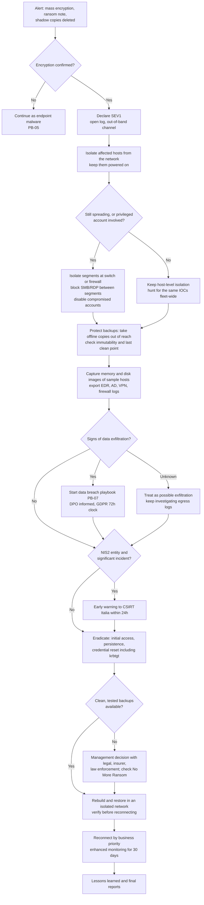

# Playbook: Ransomware

| Field | Value |
|---|---|
| ID | PB-01 |
| Default severity | SEV1 |
| Owner | IR lead |
| Often combined with | [Data breach](data-breach.md), [Compromised account](compromised-account.md) |
| CSF 2.0 | DE.AE, RS.MA, RS.AN, RS.MI, RS.CO, RC.RP, RC.CO |

Modern ransomware is the last step of an intrusion, not the first. By the time files are encrypted, the attacker has usually been inside for days: stolen credentials, moved laterally, deleted or encrypted backups, and often copied data to use for a second round of extortion. The playbook therefore treats every ransomware case as a possible data breach and a possible domain compromise until proven otherwise.

## Trigger and detection

- EDR alert for mass file modification or renaming, known ransomware family, or shadow copy deletion (`vssadmin delete shadows`, `wmic shadowcopy delete`, `wbadmin delete catalog`)
- Ransom notes on desktops or file shares, new file extensions on a share
- Users reporting files they cannot open; service desk tickets arriving in a cluster
- Backup jobs failing, backup catalogue deleted, hypervisor datastores unavailable
- An extortion email, or the company name appearing on a leak site (threat intelligence feed)

## Triage (first 30 minutes)

Answer these quickly; imperfect answers are fine, record the uncertainty.

1. Is it really encryption? Look at a sample file and the ransom note. Rule out a failing disk or a sync error.
2. How many hosts and shares are affected, and is the number still growing?
3. Which accounts are running the encryption process? A domain admin or service account means the domain is compromised.
4. Are the backups intact and out of the attacker's reach? Ask the backup admin now, not after containment.
5. Are hypervisors (ESXi, Hyper-V) or cloud workloads affected?
6. Is there any sign of data being copied out (large outbound transfers, archiving tools such as 7-Zip or WinRAR, rclone, MEGA or other cloud storage)?

Declare SEV1, open the incident log, move to an out-of-band channel if email or identity may be compromised.

## Decision flow

## Containment

Goal: stop the encryption and the attacker's movement without destroying evidence or the recovery path.

- **Isolate, do not power off.** Use EDR network containment, or pull the cable or Wi-Fi. Powering off loses memory contents. CISA's #StopRansomware Guide recommends powering down only if a device cannot be disconnected from the network.
- If many systems or whole subnets are affected, isolate at the switch or firewall level; individual isolation will not keep up. Prioritise the systems that run critical operations.
- Block lateral movement paths: SMB and RDP between workstation segments, remote management tools the attacker is using (PsExec, remote access software), outbound connections to identified C2 addresses.
- Disable the accounts seen running the encryption or moving laterally. If a domain admin is involved, plan the full credential reset (see Eradication) rather than resetting one password at a time while the attacker watches.
- **Backups first.** Disconnect backup repositories from the domain, change the backup console credentials from a clean workstation, and confirm the most recent restore point that predates the intrusion, not just the encryption.
- Suspend scheduled tasks that could spread damage: sync clients that replicate encrypted files to the cloud, automatic snapshot pruning, GPO-based software deployment.
- For cloud workloads, take snapshots of affected volumes before changing anything.

## Evidence to collect

- Memory images and system images of a sample of affected hosts, including patient zero if identified (CISA lists this step under containment and eradication)
- The ransom note, one encrypted file with its original if available, the ransomware binary or script
- EDR telemetry and alerts from at least 30 days before the first encryption event
- Domain controller security logs (logons, group membership changes, new accounts, GPO changes), VPN and remote access logs, firewall and proxy logs, DNS logs
- Backup system logs (deleted jobs, changed retention)
- Any communication from the attacker: emails, chat links, leak site screenshots with URL and time

Follow [evidence handling](../evidence-handling.md): hashes, chain of custody, copies on an isolated share.

## Eradication

Restoring before eradication is the most common reason for a second encryption.

- Identify the initial access vector: exposed RDP or VPN without MFA, an unpatched edge device, a phishing payload, a compromised supplier connection. Close it.
- Hunt for persistence: new local or domain accounts, scheduled tasks, services, Run keys, GPO changes, remote access tools, web shells on internet-facing servers.
- Reset credentials in a planned sequence: all privileged accounts, service accounts, and the `krbtgt` account **twice**. Microsoft's forest recovery guidance explains why two resets are needed (the account keeps the previous password in its history) and how long to wait between them; coordinate this with the AD team because it invalidates Kerberos tickets.
- Rotate secrets the attacker could have read: API keys, backup encryption keys, hypervisor root passwords, cloud access keys.
- Patch or rebuild the exploited systems. Reimage affected endpoints instead of cleaning them.

## Recovery

- Define recovery criteria with the service owners before you start (CSF RS.MA-05): which services first, what "working" means, who signs off.
- Rebuild in an isolated network segment. Restore data from a backup older than the first sign of intrusion, then scan it before reconnecting.
- Bring services back by business priority: identity and DNS, then core business applications, then the rest.
- Watch closely for at least 30 days: new EDR detections, logons from disabled accounts, traffic to known C2 infrastructure. Attackers often return with access they kept.
- **Paying the ransom** is a management decision, taken with legal counsel, the insurer and, ideally, law enforcement. CISA and its partners do not recommend paying: it does not guarantee decryption, does not prevent the data from being published, and may expose the organisation to sanctions risk if the recipient is a sanctioned entity. Before any discussion, check [No More Ransom](https://www.nomoreransom.org/) for a free decryptor.

## Notifications

- **GDPR**: encryption of personal data without a usable backup is a loss of availability, so it can be a personal data breach even without theft. Involve the DPO at triage. See [regulatory obligations](../regulatory.md).
- **NIS2**: for essential and important entities a ransomware attack that disrupts services is a strong candidate for a significant incident: 24-hour early warning to CSIRT Italia.
- **Law enforcement**: report to the Polizia Postale; the insurer will usually require it.
- **Staff**: tell people what to do (leave PCs on, do not plug in USB drives, use the phone for urgent matters). Template: [internal communication](../templates/internal-communication.md).

## Lessons learned

Questions the review should answer, beyond the timeline:

- How long did the attacker spend inside before encryption, and which alerts fired during that time without action?
- Did the backups survive? How long did a full restore actually take compared with the RTO on paper?
- Which accounts had more privilege than they needed? Were admin accounts used on workstations?
- Was the initial access vector known (unpatched device, VPN without MFA) and accepted as a risk?

## Mistakes to avoid

- Shutting down every machine "to be safe": you lose memory evidence and may not gain anything that isolation would not give you.
- Restoring immediately from the latest backup: it may already contain the attacker's persistence or even the dormant payload.
- Resetting passwords over email or from a workstation that may be compromised.
- Letting admins log in interactively to infected hosts with privileged accounts.
- Deleting the ransom note and encrypted files before collecting samples.
- Assuming no data was stolen because the note does not mention it.
- Negotiating or replying to the attacker without legal and management approval.

## ATT&CK techniques

IDs checked against MITRE ATT&CK Enterprise v19.2.

| ID | Technique | Where you see it |
|---|---|---|
| T1486 | Data Encrypted for Impact | The encryption itself |
| T1490 | Inhibit System Recovery | Shadow copy and backup catalogue deletion |
| T1489 | Service Stop | Stopping databases and backup services before encryption |
| T1685 | Disable or Modify Tools | EDR or antivirus tampering |
| T1133 | External Remote Services | Initial access through VPN or exposed RDP |
| T1190 | Exploit Public-Facing Application | Initial access through an edge device or web application |
| T1078 | Valid Accounts | Use of stolen credentials |
| T1021.001 / T1021.002 | Remote Desktop Protocol / SMB/Windows Admin Shares | Lateral movement |
| T1003.001 | LSASS Memory | Credential dumping |
| T1484.001 | Group Policy Modification | Mass deployment of the payload through GPO |
| T1567.002 | Exfiltration to Cloud Storage | Data theft before encryption (double extortion) |

## Checklist

**Triage**
- [ ] Encryption confirmed on at least one sample file
- [ ] Affected hosts, shares and hypervisors listed; growth rate noted
- [ ] Accounts used by the attacker identified
- [ ] SEV1 declared, IR lead and management informed, out-of-band channel active

**Containment**
- [ ] Affected hosts isolated, still powered on
- [ ] Segment-level isolation applied where spread is ongoing
- [ ] SMB/RDP between segments and remote tools blocked
- [ ] Compromised accounts disabled
- [ ] Backups disconnected, credentials changed, last clean restore point confirmed

**Evidence**
- [ ] Memory and disk images of sample hosts, hashes recorded
- [ ] Ransom note, sample encrypted file, binary preserved
- [ ] EDR, AD, VPN, firewall, proxy, DNS, backup logs exported

**Notifications**
- [ ] DPO assessed personal data impact (GDPR 72h)
- [ ] NIS2 significance assessed; early warning sent within 24h if applicable
- [ ] Insurer and law enforcement contacted
- [ ] Staff notice sent

**Eradication and recovery**
- [ ] Initial access vector closed
- [ ] Persistence removed; affected hosts reimaged
- [ ] Privileged and service credentials reset; krbtgt reset twice
- [ ] Restore in isolated segment, verified, reconnected by priority
- [ ] 30-day enhanced monitoring scheduled
- [ ] Post-incident review booked
