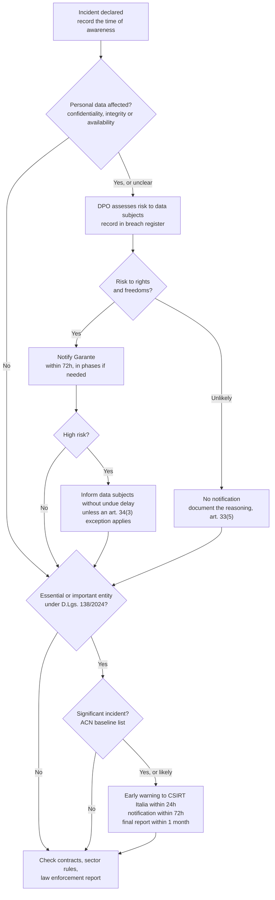

# Regulatory obligations (EU and Italy)

> **This is not legal advice.** It is a summary of the texts, written so that the response team recognises early when a legal deadline may apply and calls the right people. Whether and what to notify is decided by the organisation with its DPO and lawyers. Texts change: check the current version on the official sources linked below.

A single incident can trigger several regimes at once. A ransomware attack with data theft at a company that falls under NIS2 involves both the GDPR (personal data breach) and the NIS decree (significant incident), with different recipients, contents and deadlines. The clocks run in parallel.

## GDPR: personal data breach (Regulation (EU) 2016/679)

A personal data breach is a breach of security leading to the accidental or unlawful destruction, loss, alteration, unauthorised disclosure of, or access to, personal data. Loss of availability counts: encrypted HR files with no usable backup are a breach even if nothing was stolen.

**Art. 33: notification to the supervisory authority**

- The controller notifies the competent supervisory authority (in Italy the Garante per la protezione dei dati personali) **without undue delay and, where feasible, not later than 72 hours** after becoming aware of the breach, unless the breach is unlikely to result in a risk to the rights and freedoms of natural persons.
- If notification comes after 72 hours, it must include the reasons for the delay.
- A **processor** notifies the controller without undue delay after becoming aware of the breach.
- Minimum content (art. 33(3)): nature of the breach, including where possible categories and approximate number of data subjects and of records; name and contact details of the DPO or other contact point; likely consequences; measures taken or proposed, including mitigation.
- Information can be provided **in phases** when it is not all available at once (art. 33(4)). Do not wait for a complete investigation to notify.
- The controller **documents every breach**, notified or not: facts, effects, remedial action (art. 33(5)). In practice, a breach register.
- In Italy, notifications to the Garante are submitted through its online data breach service.

**Art. 34: communication to data subjects**

- When the breach is likely to result in a **high risk** to the rights and freedoms of natural persons, the controller informs the data subjects **without undue delay**, in clear and plain language, with at least the DPO contact, likely consequences and measures taken.
- It is not required if the data was rendered unintelligible (for example properly encrypted), if subsequent measures make the high risk no longer likely, or if it would involve disproportionate effort, in which case a public communication is used instead (art. 34(3)).

The EDPB *Guidelines 9/2022 on personal data breach notification under GDPR* explain when a controller is considered "aware" and how to assess risk.

## NIS2: significant incidents (Directive (EU) 2022/2555 and Legislative Decree 138/2024)

Italy transposed NIS2 with Legislative Decree 4 September 2024, n. 138, published in the Gazzetta Ufficiale n. 230 of 1 October 2024 and in force since 16 October 2024. The Agenzia per la cybersicurezza nazionale (ACN) is the NIS competent authority and hosts CSIRT Italia.

**Who**: essential and important entities registered under the decree. Check whether your organisation received ACN's communication of inclusion in the national NIS list.

**What is significant** (art. 25(4) of the decree): an incident that has caused or can cause serious operational disruption of services or financial losses for the entity, or that has affected or can affect other natural or legal persons causing considerable material or non-material damage. ACN Determination 379907/2025 lists the baseline significant incidents that must be notified (Annex 3 for important entities, Annex 4 for essential entities). According to ACN, the notification obligation applies from nine months after the entity received the communication of inclusion in the list, which for the first entities meant January 2026.

**Deadlines** (art. 25(5) of the decree, mirroring art. 23(4) of the directive), all addressed to **CSIRT Italia**:

| Step | Deadline | Content |
|---|---|---|
| Early warning (*pre-notifica*) | Without undue delay, and in any case **within 24 hours** of becoming aware of the significant incident | Where possible, whether it may be caused by unlawful or malicious acts, and whether it may have a cross-border impact |
| Incident notification | Without undue delay, and in any case **within 72 hours** of becoming aware | Update of the early warning, initial assessment of severity and impact, indicators of compromise where available |
| Intermediate report | On request of CSIRT Italia | Relevant status updates |
| Final report | **Within one month** of the incident notification | Detailed description, severity and impact; type of threat or root cause; mitigation applied and ongoing; cross-border impact if known |
| If still ongoing at that date | Monthly progress reports, then the final report within one month of the end of incident handling | |

Trust service providers have a shorter deadline: the incident notification is due within 24 hours (art. 25(6)).

CSIRT Italia replies, where possible within 24 hours of the early warning, with initial feedback and, on request, guidance on mitigation. If the incident appears criminal, it also gives guidance on reporting it to law enforcement (art. 25(7)-(8)). Where appropriate and after hearing CSIRT Italia, entities inform the recipients of their services of significant incidents that may affect those services (art. 25(9)).

Notifications are submitted through the CSIRT Italia portal. The article numbers and wording above come from the text published in the Gazzetta Ufficiale; later amendments may have changed details, so check the version in force on Normattiva.

## Other regimes to keep in mind

- **DORA** (Regulation (EU) 2022/2554) applies to financial entities from 17 January 2025 and has its own reporting regime for major ICT-related incidents. If you work in a bank, insurer or investment firm, that playbook takes precedence and is outside the scope of this repository.
- **Contracts**: customers, cloud providers and insurers often require notification within a set time. Collect these clauses in advance.
- **Law enforcement**: extortion, fraud and unauthorised access are crimes. A report to the Polizia Postale is often required by insurers and banks (for example to support a payment recall in a BEC case).

## Decision flow

## Official sources

- GDPR, full text: <https://eur-lex.europa.eu/eli/reg/2016/679/oj>
- Garante, data breach page: <https://www.garanteprivacy.it/regolamentoue/databreach>
- EDPB Guidelines 9/2022: <https://www.edpb.europa.eu/our-work-tools/our-documents/guidelines/guidelines-92022-personal-data-breach-notification-under_en>
- NIS2 Directive (EU) 2022/2555: <https://eur-lex.europa.eu/eli/dir/2022/2555/oj>
- Legislative Decree 138/2024 on Normattiva: <https://www.normattiva.it/uri-res/N2Ls?urn:nir:stato:decreto.legislativo:2024-09-04;138>
- ACN, NIS pages and baseline specifications: <https://www.acn.gov.it/portale/nis/modalita-specifiche-base>
- CSIRT Italia, incident notification: <https://www.csirt.gov.it/segnalazione>
