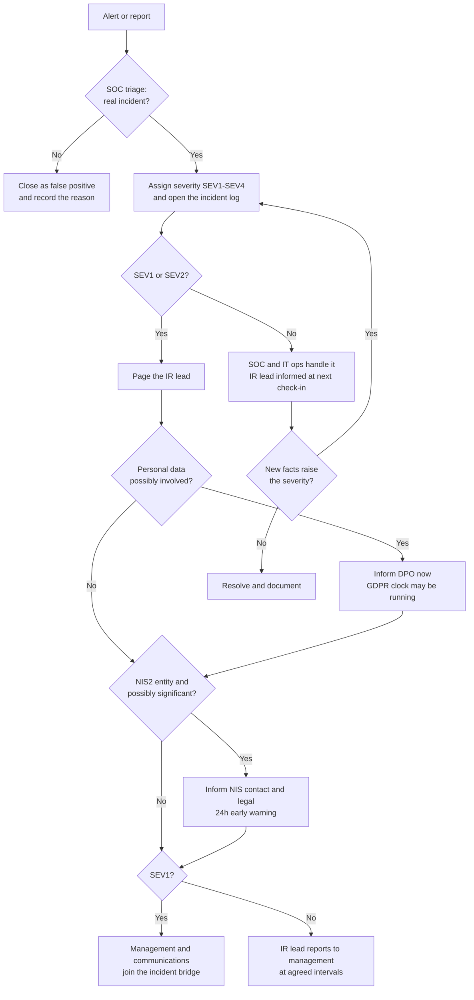

# Severity levels and escalation

Severity decides who gets woken up, how fast, and how much disruption the response team may cause without asking. It is assigned at triage and reviewed every time new facts arrive: an incident that starts as one phished mailbox can become SEV1 an hour later.

The response times below are **example values** for a mid-sized organisation with a 24/7 SOC. They are not taken from a standard; set your own and get them approved by management before you need them.

## Severity levels

| Level | Criteria (any one is enough) | Examples | Response target (example) | Who is involved |
|---|---|---|---|---|
| **SEV1 Critical** | Critical services down or at imminent risk; confirmed compromise of domain admin, identity provider or backups; confirmed exfiltration of sensitive or large volumes of personal data; likely significant incident under NIS2 | Ransomware spreading; attacker with Global Admin; customer database on a leak site | Triage within 15 min, IR lead engaged immediately, management informed within 1 h | Full IR team, management, legal, DPO, communications |
| **SEV2 High** | One important system or a business process affected; compromise of a single privileged or finance account; personal data possibly involved; active DDoS degrading a public service | BEC with a pending payment; admin account used from an unknown country; DDoS on the e-commerce site | Triage within 30 min, IR lead within 1 h | IR lead, SOC, IT ops, DPO or legal as needed |
| **SEV3 Medium** | Contained to one user or endpoint, no sign of spread or data access | Malware blocked after execution on a laptop; user entered credentials on a phishing page, MFA held | Triage within 4 h | SOC, IT ops |
| **SEV4 Low** | Attempt with no impact, policy violation, informational | Phishing reported and never opened; blocked scan | Next business day | SOC |

Two rules keep this honest:

1. **When in doubt, go one level up.** Downgrading later costs little; discovering at hour 30 that the 24-hour NIS2 deadline has passed costs a lot.
2. **Severity follows impact, not technique.** A commodity infostealer on the CFO's laptop is not SEV3.

## Escalation criteria

Escalate immediately, whatever the current level, when any of these becomes true.

| Trigger | Escalate to | Why it matters |
|---|---|---|
| Personal data may have been accessed, altered, lost or disclosed | DPO (and legal) | The GDPR 72-hour window for notifying the supervisory authority runs from awareness ([details](regulatory.md)) |
| The organisation is an essential or important entity under NIS2 and the incident could cause serious operational disruption or financial loss, or considerable damage to others | NIS contact person, legal, management | Early warning to CSIRT Italia within 24 hours ([details](regulatory.md)) |
| Privileged identity compromised (domain admin, cloud global admin, backup admin, EDR console) | IR lead, IT security manager | The attacker can disable your defences and your recovery path |
| Evidence of encryption, data destruction or extortion | IR lead, management | SEV1 by default; decisions on shutdowns, insurers, law enforcement |
| A payment is pending or has just left | Finance manager, bank contact | Recall chances drop quickly once funds are moved |
| Media, customers or partners are already aware | Communications, management | Messages must be consistent and approved |
| Criminal activity suspected (extortion, fraud) | Legal, management | Decide on reporting to the Polizia Postale; CSIRT Italia can give guidance to NIS entities |
| Third party involved (MSP, cloud provider, supplier) | Vendor manager, legal | Contractual notification duties; their logs may be needed |
| Containment would stop a critical business service | Management (service owner) | Business decision, documented with the reason |
| The team cannot contain the incident within the expected time, or lacks skills (forensics, negotiation) | IR lead, management | Activate the external IR retainer or insurer's panel |

## Escalation path

## Working rhythm during SEV1 and SEV2

- Use an out-of-band channel (phone bridge, a chat not tied to the compromised tenant) if email or identity may be compromised.
- Hold short status calls at a fixed interval, for example every 60 minutes for SEV1. Each call ends with: current severity, what changed, next actions with names, time of the next call.
- One person keeps the incident log. Decisions are written down with who made them and why, especially decisions *not* to contain or *not* to notify.
