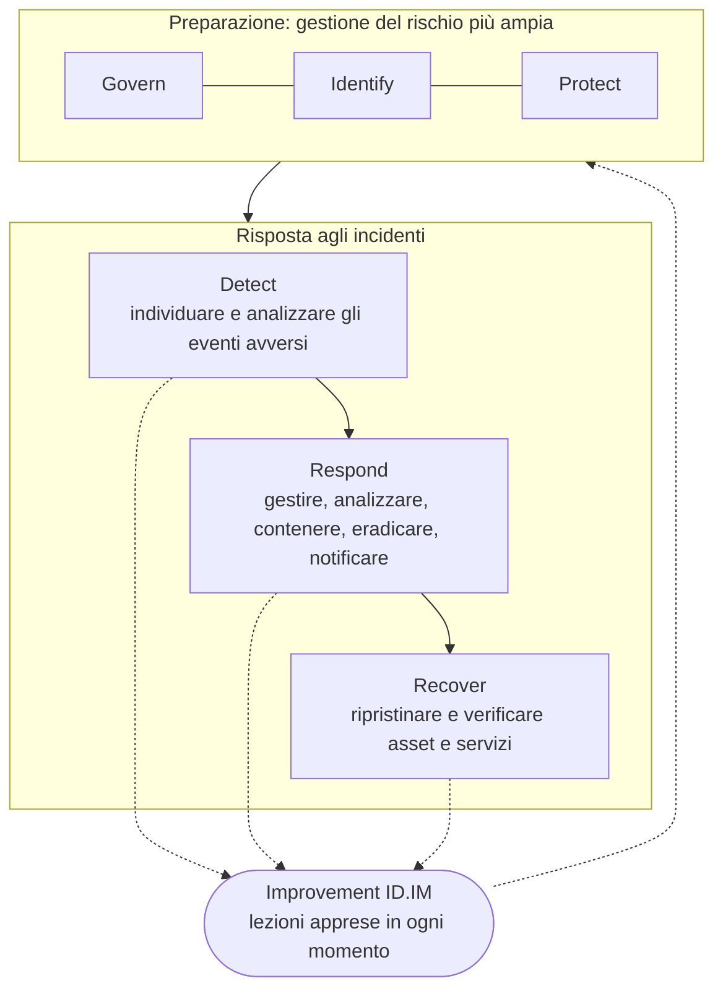

# Ciclo di vita della risposta agli incidenti

## NIST SP 800-61 Rev. 3 e CSF 2.0

Ad aprile 2025 il NIST ha pubblicato la SP 800-61 Rev. 3, *Incident Response Recommendations and Considerations for Cybersecurity Risk Management: A CSF 2.0 Community Profile*. Sostituisce la Rev. 2 del 2012 e cambia prospettiva: la risposta agli incidenti non è più un ciclo separato gestito da un team separato, ma una parte della gestione del rischio cyber, organizzata sulle sei funzioni del NIST Cybersecurity Framework 2.0.

- **Govern, Identify, Protect** sono la preparazione. Non sono risposta agli incidenti in senso stretto, ma ne determinano l'esito: ruoli, policy, inventario degli asset, log, backup, hardening.
- **Detect, Respond, Recover** sono la risposta vera e propria: individuare e analizzare gli eventi avversi, gestire e contenere l'incidente, ripristinare l'operatività.
- **Improvement** (categoria ID.IM, dentro Identify) attraversa tutto. La Rev. 3 raccomanda di condividere le lezioni appena emergono, non solo a ripristino concluso.

La Rev. 3 fa corrispondere le fasi del vecchio modello alle funzioni del CSF 2.0 (tabella 1 della pubblicazione):

| Fase della Rev. 2 | Funzioni CSF 2.0 |
|---|---|
| Preparation | Govern, Identify (tutte le categorie), Protect |
| Detection & Analysis | Detect, Identify (Improvement) |
| Containment, Eradication & Recovery | Respond, Recover, Identify (Improvement) |
| Post-Incident Activity | Identify (Improvement) |

Il NIST dice chiaramente che ogni organizzazione dovrebbe usare il modello di ciclo di vita più adatto a sé. I playbook di questo repository usano la struttura del CSF per i riferimenti e le fasi operative più note per i passaggi concreti.

## Il modello classico: PICERL

Molti team e corsi di formazione usano ancora le sei fasi rese popolari dal SANS: **Preparation, Identification, Containment, Eradication, Recovery, Lessons learned** (PICERL), cioè preparazione, identificazione, contenimento, eradicazione, ripristino e lezioni apprese. È vicino al ciclo della Rev. 2 e funziona bene come lista di controllo per il singolo incidente: per questo i playbook qui seguono quell'ordine.

Il suo limite è proprio quello su cui interviene la Rev. 3: fa pensare che gli incidenti siano rari e che il miglioramento arrivi una volta sola, alla fine. Nella realtà gli incidenti si sovrappongono, il ripristino può durare settimane e una lacuna di rilevamento scoperta il primo giorno va corretta il primo giorno.

## Corrispondenza tra playbook e CSF 2.0

| Sezione del playbook | Categoria CSF 2.0 | In pratica |
|---|---|---|
| Trigger e rilevamento | DE.CM Continuous Monitoring, DE.AE Adverse Event Analysis | L'alert o la segnalazione che avvia il processo |
| Triage | RS.MA Incident Management | Le segnalazioni vengono valutate e validate (RS.MA-02), classificate e prioritizzate (RS.MA-03), portate al livello superiore quando serve (RS.MA-04) |
| Evidenze e analisi | RS.AN Incident Analysis | Ricostruire cosa è successo e la causa, registrare le azioni, preservare l'integrità dei dati |
| Contenimento, eradicazione | RS.MI Incident Mitigation | Gli incidenti vengono contenuti (RS.MI-01) ed eradicati (RS.MI-02) |
| Notifiche | RS.CO Incident Response Reporting and Communication | Stakeholder interni ed esterni, autorità |
| Ripristino | RC.RP Incident Recovery Plan Execution, RC.CO Incident Recovery Communication | Criteri per avviare il ripristino (RS.MA-05), backup verificati, asset ripristinati, fine del ripristino dichiarata |
| Lezioni apprese | ID.IM Improvement | Azioni correttive con responsabile e scadenza |

## Termini usati in queste pagine

- **Evento / evento avverso**: qualcosa di osservabile, potenzialmente dannoso. La maggior parte degli alert sono eventi che si rivelano innocui.
- **Incidente**: un evento, confermato dal triage, che compromette o sta per compromettere riservatezza, integrità o disponibilità. Il momento in cui qualcuno dichiara l'incidente è anche, nella maggior parte dei casi, il momento in cui l'organizzazione "ne viene a conoscenza" ai fini del GDPR e della NIS2. Annota quell'orario.
- **Contenimento**: fermare la propagazione del danno senza distruggere le evidenze.
- **Eradicazione**: eliminare gli accessi e la persistenza dell'attaccante e correggere la debolezza che lo ha fatto entrare.
- **Ripristino**: riportare i sistemi in produzione in uno stato noto e affidabile, e tenerli sotto osservazione.
