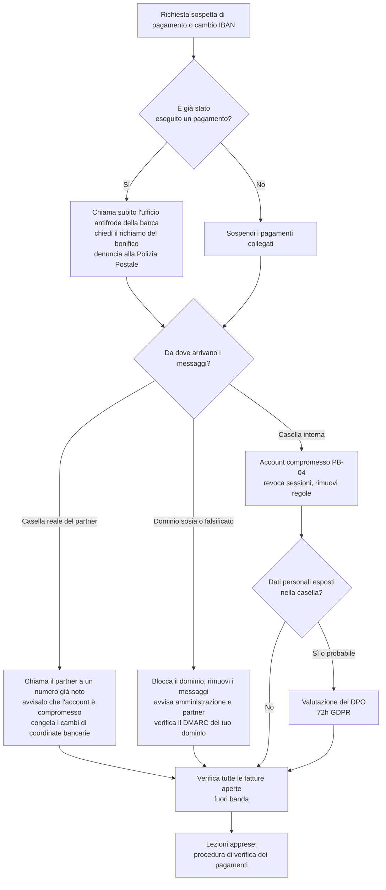

# Playbook: Business email compromise (BEC)

| Campo | Valore |
|---|---|
| ID | PB-03 |
| Severità predefinita | SEV2; SEV1 se è già partito un pagamento rilevante |
| Owner | IR lead, con il responsabile amministrativo |
| Spesso insieme a | [Account compromesso](compromised-account.md), [Phishing](phishing.md) |
| CSF 2.0 | DE.AE, RS.MA, RS.AN, RS.MI, RS.CO |

Il BEC è una frode condotta via email: un falso fornitore comunica un nuovo IBAN, un falso amministratore delegato chiede un bonifico urgente, la casella violata di un fornitore vero continua una conversazione già in corso con una fattura modificata. Spesso non c'è alcun malware. La prima ora decide se i soldi tornano indietro, per questo il playbook parte dall'amministrazione, non dall'analisi forense.

## Trigger e rilevamento

- L'amministrazione riceve la richiesta di cambiare l'IBAN di un fornitore, oppure una richiesta di pagamento urgente e riservata da parte di un dirigente
- Un fornitore chiede perché una fattura non è stata saldata, quando in realtà è stata pagata su un conto diverso
- Un dipendente nota in una conversazione una risposta che non ha scritto, o risposte indirizzate a un dominio leggermente diverso
- Il sistema di sicurezza email segnala un dominio sosia (`examp1e.com`, `example-invoices.com`) o l'impersonificazione del nome visualizzato
- Alert sulle identità relativi alla casella di un dirigente o dell'amministrazione (vedi [Account compromesso](compromised-account.md))

## Triage (primi 30 minuti)

1. **Sono già partiti dei soldi?** Importo, data e ora, banca e IBAN di destinazione, causale. Se sì, passa subito alla banca (vedi sotto), in parallelo a tutto il resto.
2. **Di quale variante si tratta?**
   - *Dominio falsificato o sosia*: i tuoi sistemi non sono compromessi, ma qualcuno si spaccia per te o per un partner.
   - *Casella interna compromessa*: l'attaccante scrive da un vero account aziendale.
   - *Casella del partner compromessa*: i messaggi fraudolenti arrivano dal dominio reale del fornitore e superano SPF/DKIM/DMARC.
3. Chi altro ha ricevuto richieste simili? Cerca nella posta lo stesso mittente, dominio, IBAN, oggetto o allegato.
4. Ci sono altri pagamenti in programma verso lo stesso fornitore?

## Flusso decisionale

## Contenimento

**Amministrazione e banca (contano i minuti)**

- Chiama per telefono l'ufficio antifrode o pagamenti della tua banca, fornisci i dati della transazione e chiedi il richiamo del bonifico. Conferma poi per iscritto. Spesso la banca chiede una denuncia: presentala alla Polizia Postale il prima possibile.
- Sospendi ogni pagamento in attesa verso il fornitore o il beneficiario coinvolto e ogni cambio di coordinate bancarie ricevuto nelle ultime settimane.
- Verifica la richiesta con la persona o il fornitore reale **attraverso un canale che avevi già**: il numero presente nell'anagrafica fornitori o in un vecchio contratto, mai quello indicato nell'email sospetta o nella sua firma.

**Posta elettronica**

- Rimuovi i messaggi fraudolenti da tutte le caselle e blocca i domini sosia sul gateway.
- Se è stata usata una casella interna: revoca sessioni e refresh token, reimposta la password, rimuovi metodi MFA, inoltri e regole sconosciuti. Di solito l'attaccante crea regole che spostano le risposte della banca o del fornitore in una cartella poco visibile (Feed RSS, Archivio), così il vero titolare non le vede.
- Se è stata usata la casella del partner: avvisalo per telefono e considera inattendibile ogni messaggio da quel dominio finché non conferma di aver risolto.

## Evidenze da raccogliere

- L'intera conversazione con gli header completi, compresi i messaggi legittimi che hanno preceduto quelli fraudolenti
- Documentazione del pagamento: ordine, approvazioni, conferma del bonifico, IBAN e intestatario fraudolenti
- Log di audit delle caselle interne coinvolte: accessi, creazione di regole, accesso ai messaggi (`MailItemsAccessed` in Microsoft 365, dove disponibile), posta inviata
- Dati di registrazione (WHOIS, data di creazione) dei domini sosia
- Numero della denuncia e riferimento della richiesta di richiamo alla banca

## Eradicazione

- Rimuovi dalle caselle interne compromesse regole, inoltri, consensi OAuth e dispositivi dell'attaccante; ricontrolla il giorno dopo.
- Verifica se l'attaccante ha usato la casella per inviare richieste fraudolente ai *tuoi* clienti. In quel caso avvisali.
- Fai rimuovere o segnala i domini sosia che imitano il tuo marchio.

## Ripristino

- Riprendi i pagamenti al fornitore solo dopo aver confermato le coordinate bancarie tramite un canale noto e dopo che una persona diversa da chi ha ricevuto la richiesta le ha registrate.
- Introduci o fai rispettare una regola: qualsiasi cambio di coordinate bancarie o pagamento urgente fuori dal flusso normale richiede una richiamata a un numero noto e un secondo approvatore.
- Verifica che il tuo dominio pubblichi SPF, DKIM e una policy DMARC applicata (`p=quarantine` o `p=reject`), così che la falsificazione diretta del tuo dominio venga bloccata.

## Notifiche

- **Forze dell'ordine**: la denuncia alla Polizia Postale sostiene il richiamo del bonifico e la pratica assicurativa.
- **GDPR**: se è stato consultato l'account di posta interno, probabilmente conteneva dati personali (clienti, dipendenti, referenti dei fornitori). Il DPO valuta il rischio.
- **Partner e clienti**: se hanno ricevuto richieste fraudolente a tuo nome, di' loro cosa ignorare e come verificare.

## Lezioni apprese

- Quale controllo avrebbe dovuto fermare il pagamento (richiamata, doppia approvazione) e perché non ha funzionato?
- Quanto tempo è passato tra la richiesta fraudolenta e il pagamento? E tra il pagamento e la chiamata alla banca?
- Qualcuno ha notato segnali d'allarme (urgenza, segretezza, nuovo IBAN in un altro paese) ma non si è sentito libero di mettere in discussione un dirigente?

## Errori da evitare

- Rispondere alla conversazione fraudolenta "per verificare": stai parlando con l'attaccante.
- Usare numeri di telefono o link presenti nell'email sospetta.
- Aspettare l'indagine IT prima di chiamare la banca.
- Colpevolizzare davanti ai colleghi la persona dell'amministrazione: il tentativo successivo non verrà segnalato.
- Considerare autentico un messaggio perché supera il DMARC: dimostra solo che il dominio è quello vero, e la casella vera del partner può essere proprio quella compromessa.

## Tecniche ATT&CK

ID verificati su MITRE ATT&CK Enterprise v19.2.

| ID | Tecnica | Dove la vedi |
|---|---|---|
| T1684.001 | Impersonation | Spacciarsi per un dirigente o un fornitore |
| T1586.002 | Compromise Accounts: Email Accounts | Casella interna o del partner violata |
| T1585.002 | Establish Accounts: Email Accounts | Caselle gratuite o nuove che imitano il fornitore |
| T1583.001 | Acquire Infrastructure: Domains | Domini sosia |
| T1114.002 / T1114.003 | Remote Email Collection / Email Forwarding Rule | Lettura della posta della vittima per scegliere il momento della frode |
| T1564.008 | Email Hiding Rules | Nascondere le risposte di banca o fornitore |
| T1657 | Financial Theft | Il bonifico fraudolento |

## Checklist

- [ ] Stato del pagamento chiarito (importo, orario, IBAN, banca)
- [ ] Ufficio antifrode della banca chiamato e richiamo richiesto (se pagato)
- [ ] Denuncia presentata alla Polizia Postale (se pagato o in caso di tentata frode)
- [ ] Pagamenti e cambi di coordinate collegati sospesi
- [ ] Variante individuata: dominio sosia, casella interna, casella del partner
- [ ] Messaggi fraudolenti rimossi, domini bloccati
- [ ] Caselle interne compromesse gestite con PB-04
- [ ] Partner avvisato per telefono a un numero noto
- [ ] Fatture aperte verificate fuori banda
- [ ] DPO informato se è stata consultata una casella interna
- [ ] Procedura di verifica dei pagamenti rivista
