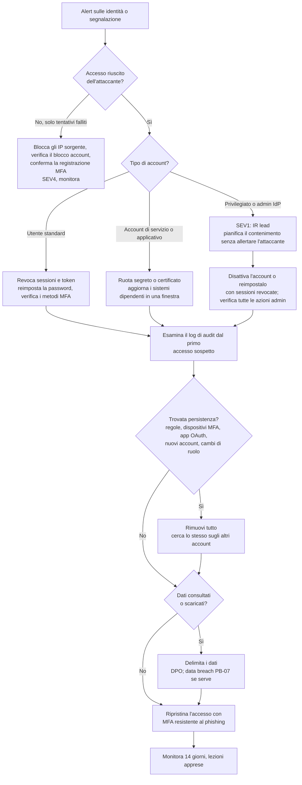

# Playbook: Account o credenziali compromessi

| Campo | Valore |
|---|---|
| ID | PB-04 |
| Severità predefinita | SEV2 per un utente standard con accesso confermato dell'attaccante; SEV1 per account privilegiati, di identity provider o di servizio |
| Owner | Responsabile SOC; IR lead per gli account privilegiati |
| Spesso insieme a | [Phishing](phishing.md), [BEC](bec.md), [Data breach](data-breach.md) |
| CSF 2.0 | DE.CM, DE.AE, RS.MA, RS.AN, RS.MI, RC.RP |

Un account valido è il modo più silenzioso per entrare in un'organizzazione: niente malware, accessi che sembrano normali, accesso esattamente a ciò che l'utente può raggiungere. Questo playbook copre account utente, privilegiati e di servizio in Active Directory on-premises e negli identity provider cloud (Entra ID, Google Workspace, Okta), oltre alle credenziali trovate in un leak.

## Trigger e rilevamento

- Alert di identity protection: impossible travel, accesso da infrastrutture di anonimizzazione, proprietà di accesso insolite, credenziali trapelate
- Molte richieste push MFA a un solo utente (MFA fatigue), o l'utente che segnala una richiesta che non ha avviato lui
- Schemi di password spraying o credential stuffing: molti account, pochi tentativi ciascuno, dalle stesse sorgenti
- Nuovo metodo o dispositivo MFA registrato, soprattutto subito dopo un accesso a rischio
- Attività fuori dalle abitudini dell'utente: download massivi, nuove regole di posta, accesso a nuove applicazioni, cambi di ruolo
- Threat intelligence o terze parti che segnalano credenziali aziendali in un log di infostealer o in un paste

## Triage (primi 30 minuti)

1. **Che tipo di account?** Utente standard, privilegiato (domain admin, Global Admin, owner di una sottoscrizione cloud), account di servizio o applicativo, esterno o guest. Privilegiati e di servizio vanno a SEV1.
2. **C'è la prova di un accesso riuscito dell'attaccante?** Cerca accessi riusciti dalla sorgente sospetta, non solo tentativi falliti. Verifica se l'MFA è stata soddisfatta e come (approvazione push, SMS, riutilizzo di un token senza alcuna richiesta MFA).
3. **Da quando?** Trova il primo accesso sospetto. Tutto ciò che viene dopo rientra nel perimetro.
4. **Cosa ha fatto l'attaccante?** Log di audit: file e posta consultati, regole create, metodi MFA aggiunti, consensi OAuth, modifiche a ruoli o gruppi, nuovi account o credenziali applicative, reset di password su altri account.
5. **È un solo account?** Cerca gli stessi IP, user agent e ASN in tutti i log di accesso.

## Flusso decisionale

## Contenimento

**Utente standard**

- Revoca tutte le sessioni e i refresh token, poi reimposta la password. Nell'ordine inverso le sessioni rubate restano valide ancora per un po'.
- Rimuovi i metodi e i dispositivi MFA che l'utente non riconosce, poi fagli registrare di nuovo l'MFA davanti al service desk o con una procedura verificata.
- Rimuovi regole di posta, inoltri, deleghe e consensi OAuth aggiunti dall'attaccante.
- Blocca gli IP dell'attaccante se sono stabili, sapendo che la maggior parte ruota su proxy residenziali.

**Account privilegiato**

- Decidi con l'IR lead se agire subito o osservare brevemente per capire il perimetro. Un attaccante con diritti amministrativi che vede disattivare il proprio account può usarne un altro che non hai ancora trovato. Nella maggior parte dei casi si agisce subito; per aspettare serve una motivazione scritta.
- Disattiva l'account o reimpostalo con le sessioni revocate, da una postazione amministrativa pulita.
- Esamina ogni azione amministrativa dal primo accesso sospetto: nuovi account, assegnazioni di ruoli, modifiche all'accesso condizionale o alla federazione, nuove registrazioni o credenziali applicative, permessi sulle caselle, modifiche alla configurazione di EDR o log.
- In Active Directory, un domain admin compromesso significa di solito reimpostare tutte le credenziali privilegiate e `krbtgt` due volte (vedi [Ransomware](ransomware.md), Eradicazione).

**Account di servizio o applicativo**

- Ruota password, segreto o certificato e aggiorna i sistemi che lo usano. Pianifica la modifica: una rotazione alla cieca può fermare la produzione.
- Limita da dove l'account può autenticarsi (accesso condizionale, restrizioni di logon), se non era già stato fatto.

## Evidenze da raccogliere

- Log di accesso dell'identity provider per l'account e per gli IP dell'attaccante su tutto il tenant
- Log di audit (modifiche alla directory, assegnazioni di ruoli, consensi alle app, registrazioni MFA)
- Log di audit della posta e di accesso ai file (SharePoint, OneDrive, Google Drive, file server) nella finestra di compromissione
- Eventi dei domain controller per gli account on-premises (accessi, richieste di ticket Kerberos, modifiche ai gruppi)
- L'origine del leak, se nota (voce di un log di infostealer, paste, URL del kit di phishing), e il dispositivo infetto, se le credenziali provengono da un malware

## Eradicazione

- Verifica che non resti alcuna persistenza: dispositivi MFA, password per le app, consensi OAuth, registrazioni applicative con nuovi segreti, ruoli aggiunti, inoltri, nuovi account.
- Se le credenziali provengono da un infostealer su un dispositivo personale o aziendale, anche quel dispositivo è compromesso: va bonificato o reinstallato e vanno reimpostate tutte le credenziali salvate nel suo browser.
- Cerca gli stessi indicatori sugli altri account: le campagne di spraying raramente vanno a segno una volta sola.

## Ripristino

- Restituisci l'accesso solo con un'MFA resistente al phishing dove possibile, o almeno con il number matching sulle notifiche push.
- Monitora l'account per 14 giorni alla ricerca di nuovi accessi a rischio o modifiche di configurazione.
- Per gli account privilegiati, prima di chiudere verifica che il modello amministrativo sia sano: account amministrativi separati, nessun uso amministrativo dalle postazioni di lavoro, elevazione just-in-time dove disponibile.

## Notifiche

Coinvolgi il DPO ogni volta che l'attaccante ha avuto accesso a dati: una casella di posta, un CRM, un sistema HR. Per un account privilegiato in un soggetto NIS, valuta se la compromissione sia già un incidente significativo anche prima di aver confermato una perdita di dati. Vedi [obblighi normativi](../regulatory.md).

## Lezioni apprese

- Come sono state ottenute le credenziali (phishing, riuso da un'altra violazione, infostealer, spraying)?
- Perché l'MFA non l'ha impedito: non registrata, fatigue, protocollo legacy senza MFA, furto di token con AiTM?
- Una policy di accesso condizionale (dispositivo conforme, località, rischio di accesso) avrebbe bloccato l'accesso?

## Errori da evitare

- Reimpostare la password senza revocare sessioni e refresh token.
- Far registrare di nuovo l'MFA con una procedura che anche l'attaccante può completare.
- Avvisare l'utente via email quando è proprio la casella di posta a essere compromessa.
- Ruotare il segreto di un account di servizio senza sapere cosa ne dipende e causare un disservizio.
- Fermarsi al primo account invece di cercare la stessa infrastruttura dell'attaccante su tutto il tenant.

## Tecniche ATT&CK

ID verificati su MITRE ATT&CK Enterprise v19.2.

| ID | Tecnica | Dove la vedi |
|---|---|---|
| T1078.002 / T1078.004 | Valid Accounts: Domain Accounts / Cloud Accounts | Accesso con credenziali rubate |
| T1110.003 | Password Spraying | Pochi tentativi su molti account |
| T1110.004 | Credential Stuffing | Credenziali riusate da altre violazioni |
| T1621 | Multi-Factor Authentication Request Generation | MFA fatigue |
| T1111 | Multi-Factor Authentication Interception | Intercettazione dei codici OTP |
| T1539 | Steal Web Session Cookie | Furto di token che aggira l'MFA |
| T1098.005 | Device Registration | L'attaccante aggiunge un proprio dispositivo MFA |
| T1098.001 / T1098.003 | Additional Cloud Credentials / Additional Cloud Roles | Persistenza tramite segreti applicativi o assegnazione di ruoli |
| T1136.003 | Create Account: Cloud Account | Nuovo account creato come backdoor |
| T1550.001 | Application Access Token | Uso di token OAuth rubati |

## Checklist

- [ ] Tipo di account e severità stabiliti
- [ ] Primo accesso sospetto individuato
- [ ] Sessioni e refresh token revocati, poi password reimpostata
- [ ] Metodi e dispositivi MFA verificati e ripuliti
- [ ] Regole di posta, inoltri, deleghe e consensi OAuth verificati
- [ ] Azioni amministrative dal primo accesso sospetto esaminate (account privilegiati)
- [ ] IP e user agent dell'attaccante cercati su tutto il tenant
- [ ] Origine delle credenziali individuata; dispositivo infetto gestito
- [ ] Dati consultati delimitati; DPO informato se rilevante
- [ ] Accesso ripristinato con MFA robusta, monitoraggio di 14 giorni impostato
