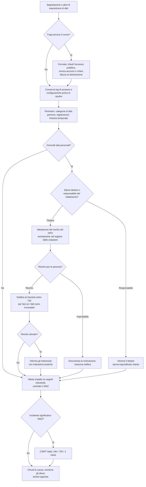

# Playbook: Data breach ed esfiltrazione

| Campo | Valore |
|---|---|
| ID | PB-07 |
| Severità predefinita | SEV1 per dati personali sensibili o su larga scala, segreti o dati regolamentati; altrimenti SEV2 |
| Owner | IR lead, con il DPO |
| Spesso insieme a | [Ransomware](ransomware.md), [Account compromesso](compromised-account.md) |
| CSF 2.0 | DE.AE, RS.MA, RS.AN, RS.MI, RS.CO, RC.CO |

In un data breach il contenimento tecnico è spesso rapido (chiudi il bucket, revochi l'account); la parte difficile è rispondere, con le prove, a queste domande: quali dati sono usciti, di chi erano e quanti sono. Da quelle risposte dipendono le decisioni sul GDPR, e il termine del GDPR non aspetta un report forense completo. L'ordine qui è: fermare la fuga, preservare le evidenze, delimitare il perimetro, valutare il rischio, notificare.

## Trigger e rilevamento

Spesso la violazione viene segnalata da qualcuno esterno all'organizzazione. Fonti tipiche:

- Alert DLP o CASB: grandi caricamenti su cloud storage personali, download massivi da SharePoint o da un CRM
- Alert di rete: volumi in uscita insoliti, connessioni lunghe verso host sconosciuti, uso di strumenti come rclone
- Threat intelligence: dati aziendali su un leak site o su un forum criminale
- Un ricercatore di sicurezza che segnala un database, un bucket o un file di backup esposto
- Un cliente o un partner che ha ricevuto da terzi i propri dati, o phishing che usa dettagli che avevi solo tu
- Un fornitore che comunica di aver subito una violazione che ha riguardato anche i tuoi dati
- Perdita o furto di un portatile o di un supporto rimovibile non cifrato

## Triage (prima ora)

1. **La fuga è ancora in corso?** Un bucket pubblico, una sessione attiva dell'attaccante, un job di sincronizzazione ancora in esecuzione.
2. **Quali dati?** Categorie (dati identificativi, di contatto, finanziari, sanitari, credenziali, categorie particolari ai sensi dell'art. 9 GDPR, segreti industriali), sistemi e file coinvolti.
3. **Di chi e quanti?** Clienti, dipendenti, minori; numero approssimativo di persone e di registrazioni. A questo punto va bene un intervallo.
4. **Quando?** Prima e ultima evidenza di accesso o trasferimento. La retention dei log può limitare ciò che riesci a dimostrare.
5. **Erano protetti?** I file erano cifrati con una chiave che l'attaccante non ha? Le password erano salvate con un algoritmo di hashing robusto?
6. **Chi è il titolare?** Se tratti i dati per conto di un cliente, devi informarlo senza ingiustificato ritardo: le notifiche le decide lui.

Annota l'ora in cui è stato dichiarato l'incidente: con ogni probabilità è il momento in cui ne sei "venuto a conoscenza" ai fini del GDPR e della NIS2.

## Flusso decisionale

## Contenimento

- Chiudi l'esposizione: togli l'accesso pubblico al bucket o alla cartella condivisa, disattiva il link anonimo, metti offline l'applicazione vulnerabile o proteggila con un'autenticazione.
- Revoca le credenziali usate: sessioni utente, chiavi API, access key, token OAuth, segreti degli account di servizio.
- Blocca le destinazioni dell'esfiltrazione (account di cloud storage, IP, domini) su proxy e firewall.
- **Prima di modificare le configurazioni, salvale**: policy e ACL del bucket, impostazioni di condivisione, log di accesso. Eliminare la risorsa esposta può cancellare l'unica prova di chi vi ha acceduto.
- Se la violazione riguarda un fornitore, limita il suo accesso ai tuoi sistemi finché non conosci il perimetro.

## Evidenze da raccogliere

- Log di accesso alla risorsa esposta (server access log del cloud storage, data event di CloudTrail, audit di SharePoint/OneDrive, audit del database)
- Prove dell'uscita dei dati: proxy, firewall, DLP, dati di flusso; telemetria EDR su strumenti di archiviazione e di upload
- Una copia dei dati così come erano esposti, o un loro inventario preciso, per delimitare il perimetro (conservala in modo sicuro: è a sua volta un dato sensibile)
- Screenshot e URL dei post sui leak site, con data e ora, raccolti da un ambiente isolato
- La segnalazione del ricercatore o della terza parte, con tutta la corrispondenza

## Eradicazione

- Correggi la causa: configurazione errata, vulnerabilità, permessi eccessivi, MFA assente, un processo che esportava dati in un luogo non protetto.
- Verifica che l'attaccante non abbia più accessi (vedi [Account compromesso](compromised-account.md) e [Ransomware](ransomware.md) per i controlli sulla persistenza).
- Cerca altre copie degli stessi dati in posizioni simili (altri bucket con la stessa convenzione di nomi, altre cartelle condivise con "chiunque abbia il link").

## Ripristino

- Rimetti in servizio con la configurazione corretta, rivista da qualcuno che non ha fatto la modifica originale.
- Reimposta le credenziali delle persone coinvolte se tra i dati c'erano password o token, e avvisale.
- Monitora gli abusi: campagne di phishing che sfruttano i dati trapelati, tentativi di frode, credential stuffing contro le tue pagine di login.

## Notifiche

È il playbook in cui le notifiche contano di più. Usa la pagina sugli [obblighi normativi](../regulatory.md) e il [modello di notifica](../templates/authority-notification.md).

- **Garante (art. 33 GDPR)**: entro 72 ore da quando se ne è venuti a conoscenza, se la violazione presenta un rischio; sono ammesse informazioni per fasi.
- **Interessati (art. 34)**: senza ingiustificato ritardo se il rischio è elevato. Spiega cosa è successo, quali dati, cosa hai fatto e cosa possono fare loro (cambiare password, fare attenzione al phishing, punto di contatto).
- **Titolare**: se sei responsabile del trattamento, informa il cliente senza ingiustificato ritardo.
- **CSIRT Italia**: se sei un soggetto NIS e l'incidente è significativo.
- **Forze dell'ordine**: il furto di dati e l'estorsione sono reati; denuncia alla Polizia Postale.

## Lezioni apprese

- Come è stata scoperta la violazione, e quanto tempo dopo il suo inizio? Il monitoraggio interno l'avrebbe intercettata?
- I log bastavano a dimostrare cosa è stato consultato e cosa no? Se no, quale retention o livello di logging va cambiato?
- Perché i dati si trovavano lì? La minimizzazione dei dati è il controllo più economico.

## Errori da evitare

- Eliminare il bucket o la cartella esposta prima di aver salvato log di accesso e configurazione.
- Aspettare la certezza assoluta prima di coinvolgere il DPO, e perdere la finestra delle 72 ore.
- Comunicare troppo presto un numero preciso di persone coinvolte e doverlo poi correggere al rialzo in pubblico.
- Contattare l'attaccante o ricomprare i dati senza l'approvazione dell'ufficio legale e della direzione.
- Scaricare i dati trapelati da siti criminali su macchine aziendali.
- Dimenticare il registro delle violazioni: anche quelle non notificate vanno documentate.

## Tecniche ATT&CK

ID verificati su MITRE ATT&CK Enterprise v19.2.

| ID | Tecnica | Dove la vedi |
|---|---|---|
| T1530 | Data from Cloud Storage | Accesso a bucket, blob, cloud drive |
| T1213 | Data from Information Repositories | Esportazioni da SharePoint, Confluence, CRM |
| T1039 | Data from Network Shared Drive | Copia massiva dai file server |
| T1074 | Data Staged | Raccolta in una cartella temporanea prima del trasferimento |
| T1560.001 | Archive via Utility | Archivi 7-Zip o WinRAR prima dell'esfiltrazione |
| T1567.002 | Exfiltration to Cloud Storage | Upload con rclone o dal browser verso MEGA, Dropbox e simili |
| T1041 | Exfiltration Over C2 Channel | Dati inviati attraverso il canale del malware |
| T1048 | Exfiltration Over Alternative Protocol | FTP, DNS, altri protocolli |
| T1537 | Transfer Data to Cloud Account | Copia verso un account cloud controllato dall'attaccante |

## Checklist

- [ ] Fuga fermata; configurazione e log di accesso salvati prima
- [ ] Credenziali e chiavi coinvolte revocate
- [ ] Categorie di dati, numero di persone e registrazioni, finestra temporale stimati
- [ ] Ruolo di titolare o responsabile chiarito
- [ ] Valutazione del rischio del DPO svolta e annotata nel registro delle violazioni
- [ ] Notifica al Garante inviata entro 72h, oppure motivazione della mancata notifica documentata
- [ ] Interessati informati in caso di rischio elevato
- [ ] Significatività NIS valutata
- [ ] Causa corretta, altre copie cercate
- [ ] Monitoraggio degli abusi dei dati trapelati attivo
