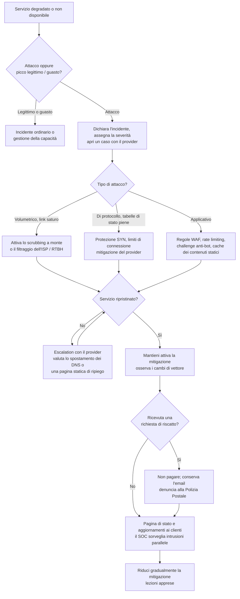

# Playbook: DDoS

| Campo | Valore |
|---|---|
| ID | PB-06 |
| Severità predefinita | SEV2; SEV1 se è fermo un servizio critico o regolamentato |
| Owner | IR lead, con le operations di rete |
| CSF 2.0 | DE.CM, DE.AE, RS.MA, RS.MI, RS.CO, RC.RP, RC.CO |

Gran parte della risposta a un DDoS si decide prima dell'attacco: se hai un servizio di scrubbing a monte o una CDN davanti alle applicazioni, se puoi cambiare rapidamente i DNS, se sai chi chiamare presso il provider. Durante l'attacco il compito del team è riconoscerne il tipo, attivare la protezione giusta e tenere informati i clienti. Bloccare gli IP sorgente uno per uno non funziona contro una botnet o un attacco a riflessione, e aumentare le risorse in cloud può trasformare un DDoS in una bolletta salata.

## Prima di un attacco (prerequisiti)

Verifica che esistano, perché il playbook ne dipende:

- Un servizio di protezione DDoS (dell'ISP, di un fornitore di scrubbing o di una CDN/WAF) con un contratto, una procedura di attivazione documentata e un contatto attivo 24/7
- Servizi pubblici raggiungibili attraverso quella protezione, oppure record DNS con TTL basso per poterli spostare
- Una baseline del traffico normale (bit al secondo, pacchetti al secondo, richieste al secondo) per i servizi principali
- Regole di rate limiting e protezione dai bot pronte da attivare su WAF o load balancer
- Una pagina di stato ospitata fuori dalla tua infrastruttura
- Avvisi di budget sul cloud, così l'auto-scaling durante un attacco non passa inosservato

## Trigger e rilevamento

- Alert di monitoraggio: servizio non disponibile, picchi di latenza, saturazione del link, tabelle di sessione di firewall o load balancer piene
- Notifica del provider di un attacco in corso
- Anomalie di traffico: volumi enormi da molte sorgenti, picchi UDP dalle porte 53, 123, 11211 o 1900 (sorgenti tipiche di riflessione), ondate di richieste HTTP verso un unico endpoint oneroso
- Un'email che chiede un pagamento per fermare o evitare un attacco (ransom DDoS)

## Triage (primi 15 minuti)

1. **È un attacco?** Escludi un picco di traffico legittimo (una campagna marketing, una citazione nei media), un rilascio andato male o un guasto del provider.
2. **Di che tipo?**
   - *Volumetrico* (flood UDP, riflessione/amplificazione): satura il link; aiuta solo il filtraggio a monte.
   - *Di protocollo* (SYN flood, pacchetti frammentati): esaurisce le tabelle di stato di firewall o load balancer.
   - *Applicativo* (flood HTTP, richieste lente, ricerche o login onerosi): sembra traffico di utenti veri; servono regole WAF, rate limiting e challenge anti-bot.
3. **Cosa è colpito?** Quali servizi, quali clienti, e se altri servizi condividono lo stesso link o firewall.
4. **Sta succedendo altro?** Un DDoS può essere un diversivo. Chiedi al SOC di tenere d'occhio tentativi di intrusione, account takeover o frodi durante l'attacco.

## Flusso decisionale

## Contenimento

- Apri un caso prioritario con l'ISP o il fornitore di protezione DDoS e comunica IP e porte presi di mira, orario di inizio e profilo del traffico osservato.
- **Volumetrico**: fai filtrare il traffico a monte dal provider. Come ultima risorsa, l'instradamento remote triggered black hole (RTBH) sull'IP attaccato impedisce che il flood abbatta tutto il resto, ma mette offline il bersaglio: è una decisione di business.
- **Di protocollo**: attiva i SYN cookie o una protezione equivalente, abbassa i timeout, applica limiti di connessione per sorgente.
- **Applicativo**: attiva il rate limiting sugli endpoint presi di mira, abilita challenge JavaScript o CAPTCHA per i client sospetti, metti in cache tutto ciò che si può, disattiva temporaneamente le funzioni onerose (ricerca full-text, generazione di report) se sono il bersaglio.
- Il geo-blocking può servire se i tuoi clienti sono tutti in una regione, ma blocca anche gli utenti veri in viaggio o dietro VPN: decidilo consapevolmente e mettilo per iscritto.
- **Non limitarti ad aumentare** le risorse cloud senza un tetto. Può tenere su il sito per un po', a un costo che l'attaccante non paga.

## Evidenze da raccogliere

- Dati di flusso (NetFlow, sFlow, IPFIX) e campioni di cattura dei pacchetti durante l'attacco
- Log di firewall, load balancer, WAF e CDN, insieme al report dell'attacco fornito dal provider
- Timeline: inizio, valori di picco (Gbps, Mpps, richieste al secondo), cambi di vettore, azioni di mitigazione e loro effetto
- Eventuali messaggi di riscatto o estorsione, con gli header completi

## Eradicazione

In un DDoS puro non c'è nulla da rimuovere dai tuoi sistemi. Il lavoro consiste nel chiudere ciò che ha reso efficace l'attacco: server di origine raggiungibili direttamente da internet aggirando la CDN, servizi esposti senza motivo (resolver DNS aperti, NTP, memcached, che ti trasformano anche in un riflettore per attacchi contro altri), rate limiting assente.

## Ripristino

- Riduci gradualmente la mitigazione e osserva se l'attacco riprende: molti attacchi arrivano a ondate.
- Verifica che tutti i servizi, compresi quelli che condividono l'infrastruttura con il bersaglio, funzionino normalmente.
- Controlla la fattura del cloud e chiedi al provider eventuali crediti per i consumi dovuti all'attacco, se il contratto lo prevede.

## Notifiche

- Clienti: pubblica aggiornamenti sulla pagina di stato e tramite i canali di assistenza. Di' cosa è colpito e quando arriverà il prossimo aggiornamento; non fare ipotesi su chi ci sia dietro.
- NIS2: per i soggetti essenziali e importanti un'interruzione prolungata di un servizio può essere un incidente significativo. Valutalo presto: vale il termine delle 24 ore. Vedi [obblighi normativi](../regulatory.md).
- Forze dell'ordine: denuncia i tentativi di estorsione alla Polizia Postale.

## Lezioni apprese

- Quanto tempo è passato tra l'inizio dell'attacco e l'attivazione della mitigazione? Dove si è perso tempo (rilevamento, contatto con il provider, approvazioni)?
- La protezione del provider copriva tutti i servizi attaccati, o alcuni ne erano fuori?
- La pagina di stato e la comunicazione ai clienti hanno funzionato?

## Errori da evitare

- Provare a bloccare a mano gli IP attaccanti, uno alla volta.
- Pagare una richiesta di riscatto DDoS: ti segnala come bersaglio che paga.
- Aumentare le risorse cloud senza un tetto.
- Concentrarsi solo sul disservizio e non accorgersi di un tentativo di intrusione in corso nello stesso momento.
- Scoprire durante l'attacco che mancano il contratto di protezione, il contatto del provider o le credenziali di accesso ai DNS.

## Tecniche ATT&CK

ID verificati su MITRE ATT&CK Enterprise v19.2.

| ID | Tecnica | Dove la vedi |
|---|---|---|
| T1498 | Network Denial of Service | Flood diretti contro la banda |
| T1498.001 | Direct Network Flood | Flood UDP, ICMP, SYN da una botnet |
| T1498.002 | Reflection Amplification | Richieste falsificate verso riflettori DNS, NTP, memcached, CLDAP |
| T1499 | Endpoint Denial of Service | Attacchi al servizio anziché al link |
| T1499.002 | Service Exhaustion Flood | Flood HTTP, abuso della rinegoziazione TLS |
| T1499.003 | Application Exhaustion Flood | Richieste a funzioni onerose (ricerca, login) |

## Checklist

- [ ] Attacco confermato, picco legittimo o guasto esclusi
- [ ] Tipo di attacco individuato (volumetrico, di protocollo, applicativo)
- [ ] Caso aperto con il provider, mitigazione attivata
- [ ] WAF, rate limiting e challenge anti-bot applicati per gli attacchi applicativi
- [ ] Scaling cloud con un tetto, budget sotto controllo
- [ ] SOC che sorveglia intrusioni o frodi parallele
- [ ] Pagina di stato e aggiornamenti ai clienti pubblicati
- [ ] Richiesta di riscatto conservata e denunciata, non pagata
- [ ] Significatività NIS valutata
- [ ] Dati di flusso, log e report del provider raccolti
- [ ] Mitigazione ridotta gradualmente, servizi verificati
