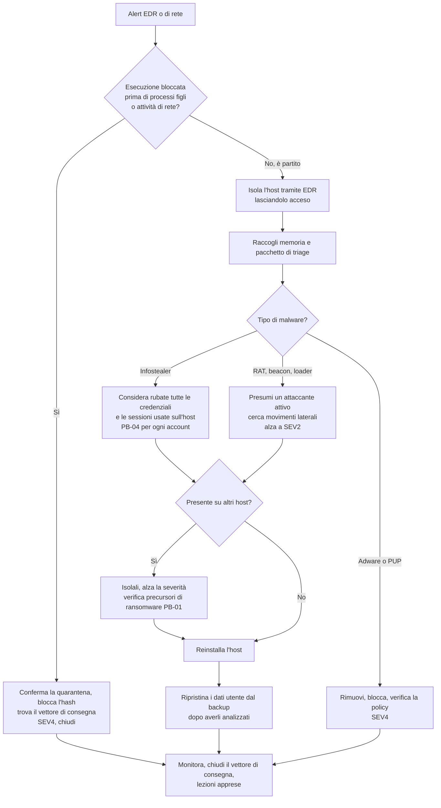

# Playbook: Malware su un endpoint

| Campo | Valore |
|---|---|
| ID | PB-05 |
| Severità predefinita | SEV3; SEV2 se si tratta di un server, di una postazione amministrativa o di un infostealer; SEV1 se si propaga |
| Owner | Responsabile SOC |
| Spesso insieme a | [Phishing](phishing.md), [Account compromesso](compromised-account.md), [Ransomware](ransomware.md) |
| CSF 2.0 | DE.CM, DE.AE, RS.MA, RS.AN, RS.MI, RC.RP |

La domanda non è solo "è stato rimosso?", ma "cosa ha potuto fare mentre era in esecuzione?". Un loader bloccato al primo stadio è un ticket breve. Un infostealer rimasto attivo sei ore ha probabilmente inviato al suo operatore tutte le password e i cookie di sessione salvati nel browser, e il vero incidente sono gli account, non il portatile.

## Trigger e rilevamento

- Rilevamento di EDR o antivirus, soprattutto quando l'azione è "rilevato" e non "bloccato"
- Comportamento sospetto: Office che avvia PowerShell o `cmd.exe`, comandi codificati, LOLBin (`mshta`, `rundll32`, `regsvr32`, `certutil`) che scaricano file
- Alert di rete: beaconing verso un dominio o un IP C2 noto, richieste DNS verso un dominio registrato da poco
- Segnalazione dell'utente: pop-up, un documento che "non ha fatto niente" quando è stato aperto, una falsa pagina di aggiornamento

## Triage (primi 30 minuti)

1. **L'esecuzione è stata bloccata o il codice è partito?** Controlla l'albero dei processi nell'EDR: processo padre, riga di comando, processi figli, connessioni di rete, file scritti.
2. **Di cosa si tratta?** Ricerca dell'hash in threat intelligence, nome della famiglia dall'EDR, report della sandbox. Classifica: adware o PUP, loader o dropper, infostealer, trojan di accesso remoto, precursore di ransomware (beacon Cobalt Strike o simili).
3. **Di chi è la macchina?** Utente standard, amministratore, sviluppatore con chiavi di produzione, amministrazione, server.
4. **Come è arrivato?** Allegato email, download, USB, servizio sfruttato, aggiornamento software.
5. **È presente altrove?** Cerca su tutta la flotta, tramite l'EDR, l'hash, il nome del file, il dominio C2 e lo schema della riga di comando.

## Flusso decisionale

## Contenimento

- **Isola l'host tramite l'EDR** (il contenimento di rete lascia aperto il canale dell'EDR, così puoi continuare a indagare). Non spegnerlo.
- Blocca l'hash, i domini e gli IP C2 su EDR, proxy, filtro DNS e firewall.
- Se il malware è un infostealer, contieni gli account, non solo il dispositivo: revoca le sessioni e reimposta le password di tutti gli account a cui l'utente ha acceduto da quel browser, compresi i SaaS e gli account personali usati sul dispositivo aziendale. Segui [Account compromesso](compromised-account.md).
- Se è uno strumento di accesso remoto o un beacon C2, presumi che un operatore sia attivo. Controlla i movimenti laterali a partire dall'host (RDP, SMB, WMI, PsExec) e il dump delle credenziali.

## Evidenze da raccogliere

- Immagine della memoria prima di qualsiasi bonifica
- Pacchetto di triage dell'EDR o raccolta con Velociraptor/KAPE: elenco dei processi, connessioni di rete, autorun, attività pianificate, servizi, prefetch, event log, cronologia del browser
- Il campione (dalla quarantena) conservato in un archivio protetto da password, con il suo hash
- L'artefatto di consegna: email, URL di download, dati del dispositivo USB
- Log di proxy e DNS dell'host nella finestra di infezione

## Eradicazione

- **Reinstalla l'host** per qualsiasi cosa vada oltre un adware o un'esecuzione bloccata al primo stadio. Eliminare i file che l'antivirus conosce non elimina la persistenza che non conosce, e non puoi dimostrare che la macchina sia pulita.
- Prima di reinstallare, documenta la persistenza trovata (chiavi Run, attività pianificate, servizi, sottoscrizioni WMI, cartella Esecuzione automatica). Usala per cercare sugli altri host.
- Chiudi il vettore di consegna: blocca il tipo di file sul gateway email, togli i diritti di amministratore locale, aggiorna l'applicazione sfruttata, blocca le macro dei file provenienti da internet.

## Ripristino

- Reinstalla dall'immagine standard, applica gli aggiornamenti e registra di nuovo il dispositivo su EDR e strumenti di gestione prima di restituirlo.
- Ripristina i file dell'utente da backup o dalla sincronizzazione cloud, dopo averli analizzati, a una data precedente all'infezione. Non ricopiare eseguibili o script dal disco infetto.
- Tieni sotto osservazione per due settimane gli account dell'utente e il nuovo dispositivo.

## Notifiche

Di solito solo interne. Diventa una questione di notifica se il malware ha dato accesso a dati personali (un infostealer sulla postazione dell'ufficio personale o del servizio clienti, un RAT su un file server) o se ha interrotto un servizio essenziale. Vedi [obblighi normativi](../regulatory.md).

## Lezioni apprese

- Perché è partito: regola ASR mancante, utente amministratore locale, tipo di file non bloccato, EDR in modalità audit?
- Quanto tempo è passato tra l'esecuzione e l'isolamento?
- Se era un infostealer: le password aziendali erano salvate nel browser? Esiste un password manager e viene usato?

## Errori da evitare

- "Pulire" la macchina con una scansione antivirus e restituirla all'utente.
- Reinstallare prima di aver raccolto memoria e dati di triage, e poi non sapere cosa ha fatto il malware.
- Trattare un infostealer come un problema del dispositivo e dimenticare credenziali e sessioni rubate.
- Caricare il campione su una sandbox pubblica quando può contenere dati interni (i documenti con macro spesso ne contengono).
- Accedere all'host infetto con un account domain admin.

## Tecniche ATT&CK

ID verificati su MITRE ATT&CK Enterprise v19.2.

| ID | Tecnica | Dove la vedi |
|---|---|---|
| T1204.002 | User Execution: Malicious File | L'utente apre l'allegato o il file scaricato |
| T1059.001 | PowerShell | Download cradle, comandi codificati |
| T1027 | Obfuscated Files or Information | Payload compressi o codificati |
| T1105 | Ingress Tool Transfer | Download del secondo stadio |
| T1071.001 | Application Layer Protocol: Web Protocols | C2 su HTTPS |
| T1547.001 | Registry Run Keys / Startup Folder | Persistenza all'accesso |
| T1053.005 | Scheduled Task | Persistenza ed esecuzione |
| T1543.003 | Windows Service | Persistenza come servizio |
| T1003.001 | LSASS Memory | Dump delle credenziali da parte di un operatore |
| T1539 | Steal Web Session Cookie | Infostealer che sottraggono le sessioni del browser |
| T1685 | Disable or Modify Tools | Tentativi di disattivare EDR o antivirus |

## Checklist

- [ ] Stato dell'esecuzione confermato (bloccata o avvenuta)
- [ ] Host isolato tramite EDR e ancora acceso
- [ ] Memoria e pacchetto di triage raccolti, campione conservato con hash
- [ ] Tipo di malware individuato
- [ ] Hash, domini e IP bloccati
- [ ] Ricerca degli IOC su tutta la flotta completata
- [ ] Infostealer: tutti gli account usati sull'host gestiti con PB-04
- [ ] Persistenza documentata, host reinstallato
- [ ] Dati utente ripristinati da un punto pulito
- [ ] Vettore di consegna chiuso
