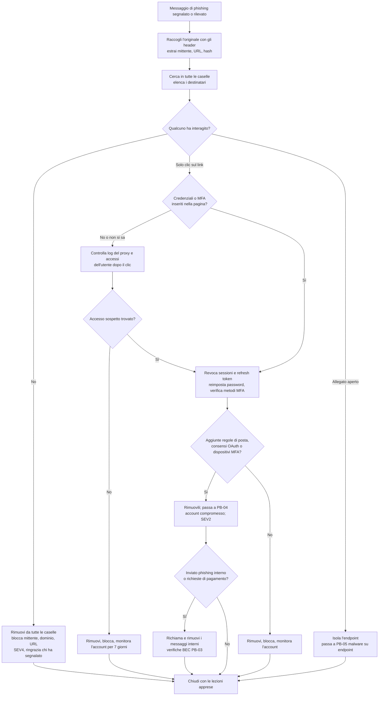

# Playbook: Phishing

| Campo | Valore |
|---|---|
| ID | PB-02 |
| Severità predefinita | SEV4 se nessuno ha interagito, SEV3 se qualcuno ha cliccato, SEV2 se sono state catturate credenziali o token o è stato eseguito un payload |
| Owner | Responsabile SOC |
| Spesso insieme a | [Account compromesso](compromised-account.md), [Malware su endpoint](endpoint-malware.md), [BEC](bec.md) |
| CSF 2.0 | DE.AE, RS.MA, RS.AN, RS.MI, RS.CO |

La maggior parte degli incidenti di phishing è piccola. Il lavoro consiste nel capire in fretta se questo lo è: chi ha ricevuto il messaggio, chi ha cliccato, chi ha digitato una password o aperto un allegato, e se l'attaccante ha già usato ciò che ha ottenuto. I kit adversary-in-the-middle (AiTM) rubano il cookie di sessione dopo che la vittima ha completato l'MFA, quindi "l'utente ha l'MFA" non chiude il caso.

## Trigger e rilevamento

- Un utente segnala un messaggio (pulsante di segnalazione, inoltro alla casella del SOC)
- Alert del sistema di sicurezza email: URL o allegato malevolo rilevato dopo la consegna, impersonificazione di un dirigente o di un fornitore
- Alert di proxy o DNS: connessione a un dominio di phishing noto o registrato da poco
- Alert dell'identity provider: accesso da una località o un'infrastruttura insolita subito dopo un clic, nuovo metodo MFA registrato

## Triage (primi 30 minuti)

1. Recupera il messaggio originale con gli header completi (non un inoltro dal client dell'utente, che li elimina). Annota mittente, return-path, reply-to, IP di invio, esiti SPF/DKIM/DMARC, URL, hash degli allegati.
2. Stabilisci il tipo: link di raccolta credenziali, allegato malevolo, callback phishing (chiede alla vittima di chiamare un numero), codice QR, o semplice pretesto che prepara un BEC.
3. Trova tutti i destinatari: cerca sulla piattaforma di posta per mittente, oggetto, URL e hash dell'allegato. Le campagne colpiscono raramente una sola persona.
4. Trova chi ha interagito: clic registrati dal gateway email, log di proxy e DNS per il dominio di phishing, esecuzione dell'allegato sugli endpoint (EDR).
5. Per ogni utente che ha cliccato su una pagina di credenziali, controlla nei log di accesso se ci sono autenticazioni riuscite da IP o ASN sconosciuti dopo l'orario del clic.

## Flusso decisionale

## Contenimento

- **Cerca e rimuovi** il messaggio da tutte le caselle, comprese quelle degli utenti che non l'hanno segnalato (Microsoft 365: Threat Explorer o Content Search con purge; Google Workspace: strumento di indagine sulla sicurezza). Conserva una copia tra le evidenze.
- **Blocca** l'indirizzo o il dominio del mittente, gli URL e gli hash degli allegati su gateway email, proxy o filtro DNS ed EDR. Per i domini sosia blocca il dominio, non solo l'indirizzo.
- Per gli utenti che hanno inserito le credenziali o approvato una richiesta MFA:
  - **Revoca prima tutte le sessioni e i refresh token** (Entra ID: *Revoke sessions*, oppure `revokeSignInSessions` tramite Microsoft Graph; Google Workspace: disconnetti l'utente e reimposta i cookie di accesso). Il solo cambio della password non invalida un cookie di sessione rubato.
  - Reimposta la password.
  - Controlla i metodi e i dispositivi MFA registrati e rimuovi quelli che l'utente non riconosce.
  - Controlla le regole della casella (inoltro, spostamento in cartelle, eliminazione), le impostazioni di inoltro e le deleghe.
  - Controlla le applicazioni OAuth a cui l'utente ha dato il consenso di recente e revoca quelle sconosciute.
- Se l'allegato è stato aperto, isola l'endpoint tramite l'EDR e segui il playbook [malware su endpoint](endpoint-malware.md).

## Evidenze da raccogliere

- Messaggio originale in formato `.eml` o `.msg` con gli header
- Elenco dei destinatari ed elenco di chi ha cliccato e quando (log di gateway, proxy, DNS)
- La pagina di phishing: URL, screenshot, dati di hosting, raccolti da un browser di analisi isolato o da un servizio di scansione degli URL
- Hash dell'allegato e report della sandbox (sui servizi pubblici invia gli hash, non i file che possono contenere dati interni)
- Log di accesso e di audit degli account coinvolti dall'orario del clic in poi: IP, user agent, dettagli MFA, nuovi dispositivi, modifiche a casella e consensi

## Eradicazione

- Verifica che non restino regole di posta, inoltri, deleghe, consensi OAuth o metodi MFA aggiunti dall'attaccante.
- Se l'attaccante ha inviato email dall'account compromesso, individua i destinatari (interni ed esterni) e avvisali.
- Segnala il dominio di phishing al registrar o al provider di hosting e, se imita il tuo marchio, ai servizi anti-abuso competenti.

## Ripristino

- Gli utenti rientrano con una nuova password e metodi MFA verificati. Dove possibile passali a un'MFA resistente al phishing (chiavi di sicurezza FIDO2, passkey, autenticazione basata su certificati): è il controllo che ferma i kit AiTM.
- Monitora gli account coinvolti per sette giorni alla ricerca di nuovi accessi anomali.
- Racconta a chi ha segnalato com'è andata. Le persone continuano a segnalare quando vedono che è servito.

## Notifiche

Un incidente di phishing diventa una questione di notifica quando l'attaccante ha avuto accesso a una casella di posta o a un archivio documentale con dati personali. Coinvolgi il DPO appena è confermato un accesso dell'attaccante: le caselle di posta contengono quasi sempre dati personali. Vedi [obblighi normativi](../regulatory.md).

## Lezioni apprese

- Quanto tempo è passato tra la consegna e la prima segnalazione? E tra la segnalazione e la rimozione?
- Perché il gateway email l'ha lasciato passare (dominio nuovo, servizio di hosting legittimo, codice QR, DMARC superato perché arrivava da un partner compromesso)?
- Le policy di accesso condizionale (dispositivo conforme, località attendibili) hanno limitato ciò che l'attaccante poteva fare con la sessione rubata?

## Errori da evitare

- Reimpostare la password e considerare l'account al sicuro: sessioni e refresh token rubati con un AiTM continuano a funzionare finché non vengono revocati.
- Rimuovere il messaggio solo dalla casella di chi l'ha segnalato.
- Aprire il link di phishing da una normale postazione aziendale "per dare un'occhiata".
- Colpevolizzare l'utente che ha cliccato: la volta successiva non segnalerà.
- Bloccare solo il nome visualizzato o un singolo indirizzo mittente: l'attaccante li cambia in pochi secondi. Blocca il dominio e gli URL.

## Tecniche ATT&CK

ID verificati su MITRE ATT&CK Enterprise v19.2.

| ID | Tecnica | Dove la vedi |
|---|---|---|
| T1566.001 | Spearphishing Attachment | Documento o archivio malevolo |
| T1566.002 | Spearphishing Link | Pagina di raccolta credenziali |
| T1566.003 | Spearphishing via Service | Messaggio tramite Teams, LinkedIn o simili |
| T1204.001 / T1204.002 | Malicious Link / Malicious File | Il clic o l'esecuzione da parte dell'utente |
| T1557 | Adversary-in-the-Middle | Kit AiTM che fanno da proxy a login e MFA |
| T1539 | Steal Web Session Cookie | Cookie di sessione catturato dopo l'MFA |
| T1550.004 | Web Session Cookie | Riutilizzo del cookie rubato |
| T1114.003 | Email Forwarding Rule | Inoltro verso un indirizzo esterno |
| T1564.008 | Email Hiding Rules | Regole che nascondono risposte o avvisi di sicurezza |
| T1098.005 | Device Registration | L'attaccante registra un proprio dispositivo MFA |
| T1528 | Steal Application Access Token | Consenso OAuth illecito |
| T1534 | Internal Spearphishing | Nuovo phishing inviato dalla casella compromessa |

## Checklist

- [ ] Messaggio originale con header salvato
- [ ] Tutti i destinatari individuati
- [ ] Messaggio rimosso da tutte le caselle
- [ ] Mittente, dominio, URL e hash bloccati
- [ ] Utenti che hanno cliccato individuati da log di gateway, proxy e DNS
- [ ] Log di accesso controllati per ogni utente che ha cliccato
- [ ] Per gli utenti compromessi: sessioni e token revocati, password reimpostata, metodi MFA verificati
- [ ] Regole di posta, inoltri, deleghe e consensi OAuth verificati
- [ ] Endpoint che hanno aperto allegati isolati e passati a PB-05
- [ ] DPO informato se è confermato un accesso dell'attaccante
- [ ] Chi ha segnalato ringraziato e informato dell'esito
