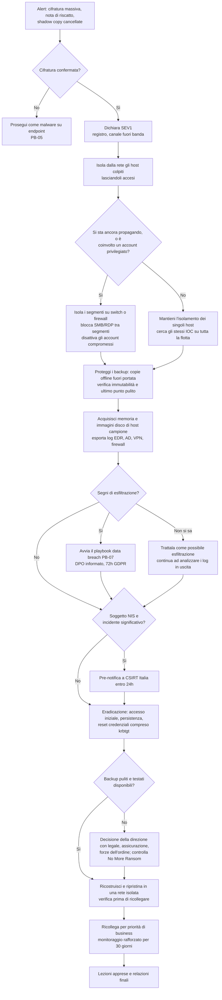

# Playbook: Ransomware

| Campo | Valore |
|---|---|
| ID | PB-01 |
| Severità predefinita | SEV1 |
| Owner | IR lead |
| Spesso insieme a | [Data breach](data-breach.md), [Account compromesso](compromised-account.md) |
| CSF 2.0 | DE.AE, RS.MA, RS.AN, RS.MI, RS.CO, RC.RP, RC.CO |

Il ransomware di oggi è l'ultimo passo di un'intrusione, non il primo. Quando i file vengono cifrati, di solito l'attaccante è dentro da giorni: ha rubato credenziali, si è mosso lateralmente, ha cancellato o cifrato i backup e spesso ha copiato dati da usare per una seconda estorsione. Per questo il playbook tratta ogni caso di ransomware come un possibile data breach e una possibile compromissione del dominio, finché non si dimostra il contrario.

## Trigger e rilevamento

- Alert EDR per modifica o rinomina massiva di file, famiglia ransomware nota o cancellazione delle shadow copy (`vssadmin delete shadows`, `wmic shadowcopy delete`, `wbadmin delete catalog`)
- Note di riscatto sui desktop o nelle cartelle condivise, nuove estensioni dei file su uno share
- Utenti che non riescono ad aprire i file; ticket al service desk che arrivano a grappolo
- Job di backup falliti, catalogo dei backup cancellato, datastore degli hypervisor non disponibili
- Un'email di estorsione, o il nome dell'azienda su un leak site (feed di threat intelligence)

## Triage (primi 30 minuti)

Rispondi in fretta; vanno bene risposte imperfette, purché l'incertezza sia annotata.

1. È davvero cifratura? Esamina un file di esempio e la nota di riscatto. Escludi un disco guasto o un errore di sincronizzazione.
2. Quanti host e share sono colpiti, e il numero sta ancora crescendo?
3. Con quali account gira il processo di cifratura? Se è un domain admin o un account di servizio, il dominio è compromesso.
4. I backup sono integri e fuori dalla portata dell'attaccante? Chiedilo subito all'amministratore dei backup, non dopo il contenimento.
5. Sono colpiti hypervisor (ESXi, Hyper-V) o workload cloud?
6. Ci sono segni di dati copiati verso l'esterno (grandi trasferimenti in uscita, strumenti di archiviazione come 7-Zip o WinRAR, rclone, MEGA o altri cloud storage)?

Dichiara il SEV1, apri il registro dell'incidente e passa a un canale fuori banda se la posta o le identità possono essere compromesse.

## Flusso decisionale

## Contenimento

Obiettivo: fermare la cifratura e i movimenti dell'attaccante senza distruggere le evidenze né il percorso di ripristino.

- **Isola, non spegnere.** Usa il contenimento di rete dell'EDR, oppure stacca il cavo o il Wi-Fi. Spegnendo si perde il contenuto della memoria. La #StopRansomware Guide della CISA raccomanda di spegnere solo i dispositivi che non si riesce a scollegare dalla rete.
- Se sono colpiti molti sistemi o intere sottoreti, isola a livello di switch o firewall: l'isolamento dei singoli host non terrebbe il passo. Dai la priorità ai sistemi che reggono le attività critiche.
- Chiudi le vie di movimento laterale: SMB e RDP tra i segmenti delle postazioni, strumenti di gestione remota usati dall'attaccante (PsExec, software di accesso remoto), connessioni in uscita verso gli indirizzi C2 individuati.
- Disattiva gli account visti eseguire la cifratura o muoversi lateralmente. Se c'è di mezzo un domain admin, pianifica il reset completo delle credenziali (vedi Eradicazione) invece di cambiare una password alla volta sotto gli occhi dell'attaccante.
- **Prima i backup.** Scollega i repository di backup dal dominio, cambia le credenziali della console di backup da una postazione pulita e individua l'ultimo punto di ripristino precedente all'intrusione, non solo alla cifratura.
- Sospendi le attività automatiche che possono estendere il danno: client di sincronizzazione che replicano i file cifrati sul cloud, eliminazione automatica degli snapshot, distribuzione di software tramite GPO.
- Per i workload cloud, fai uno snapshot dei volumi colpiti prima di modificare qualsiasi cosa.

## Evidenze da raccogliere

- Immagini della memoria e del sistema di un campione di host colpiti, compreso il paziente zero se individuato (la CISA colloca questo passaggio tra contenimento ed eradicazione)
- La nota di riscatto, un file cifrato con il suo originale se disponibile, il binario o lo script del ransomware
- Telemetria e alert EDR di almeno 30 giorni prima del primo evento di cifratura
- Log di sicurezza dei domain controller (accessi, modifiche ai gruppi, nuovi account, modifiche alle GPO), log di VPN e accesso remoto, log di firewall e proxy, log DNS
- Log del sistema di backup (job cancellati, retention modificata)
- Ogni comunicazione dell'attaccante: email, link a chat, screenshot del leak site con URL e orario

Segui la [gestione delle evidenze](../evidence-handling.md): hash, catena di custodia, copie su uno share isolato.

## Eradicazione

Ripristinare prima di eradicare è il motivo più frequente di una seconda cifratura.

- Individua il vettore di accesso iniziale: RDP esposto o VPN senza MFA, un apparato perimetrale non aggiornato, un payload di phishing, la connessione di un fornitore compromesso. Chiudilo.
- Cerca la persistenza: nuovi account locali o di dominio, attività pianificate, servizi, chiavi Run, modifiche alle GPO, strumenti di accesso remoto, web shell sui server esposti su internet.
- Reimposta le credenziali seguendo una sequenza pianificata: tutti gli account privilegiati, gli account di servizio e l'account `krbtgt` **due volte**. La guida Microsoft al ripristino della foresta AD spiega perché servono due reset (l'account conserva la password precedente nella cronologia) e quanto attendere tra l'uno e l'altro; coordinati con il team AD, perché l'operazione invalida i ticket Kerberos.
- Ruota i segreti che l'attaccante può aver letto: chiavi API, chiavi di cifratura dei backup, password di root degli hypervisor, chiavi di accesso cloud.
- Aggiorna o ricostruisci i sistemi sfruttati. Reinstalla gli endpoint colpiti invece di "pulirli".

## Ripristino

- Definisci con gli owner dei servizi i criteri di ripristino prima di iniziare (CSF RS.MA-05): quali servizi per primi, cosa significa "funzionante", chi dà il via libera.
- Ricostruisci in un segmento di rete isolato. Ripristina i dati da un backup precedente al primo segno di intrusione, poi analizzali prima di ricollegarli.
- Riporta online i servizi in ordine di priorità: identità e DNS, poi le applicazioni principali, poi il resto.
- Tieni tutto sotto stretta osservazione per almeno 30 giorni: nuovi rilevamenti EDR, accessi da account disattivati, traffico verso infrastrutture C2 note. Spesso gli attaccanti tornano con accessi che si erano tenuti da parte.
- **Pagare il riscatto** è una decisione della direzione, presa con l'ufficio legale, l'assicurazione e, possibilmente, le forze dell'ordine. La CISA e i suoi partner sconsigliano di pagare: non garantisce la decifratura, non impedisce la pubblicazione dei dati e può esporre l'organizzazione a rischi legati alle sanzioni se il destinatario è un soggetto sanzionato. Prima di qualsiasi discussione, controlla su [No More Ransom](https://www.nomoreransom.org/) se esiste un decryptor gratuito.

## Notifiche

- **GDPR**: la cifratura di dati personali senza un backup utilizzabile è una perdita di disponibilità, quindi può essere una violazione di dati personali anche senza furto. Coinvolgi il DPO già al triage. Vedi [obblighi normativi](../regulatory.md).
- **NIS2**: per i soggetti essenziali e importanti un ransomware che interrompe i servizi è un candidato forte a incidente significativo: pre-notifica a CSIRT Italia entro 24 ore.
- **Forze dell'ordine**: denuncia alla Polizia Postale; di solito l'assicurazione la richiede.
- **Personale**: di' alle persone cosa fare (lasciare i PC accesi, non collegare chiavette USB, usare il telefono per le urgenze). Modello: [comunicazione interna](../templates/internal-communication.md).

## Lezioni apprese

Domande a cui la revisione deve rispondere, oltre alla timeline:

- Quanto tempo è rimasto dentro l'attaccante prima della cifratura, e quali alert sono scattati in quel periodo senza che nessuno intervenisse?
- I backup hanno retto? Quanto è durato davvero un ripristino completo rispetto all'RTO scritto sulla carta?
- Quali account avevano più privilegi del necessario? Gli account amministrativi venivano usati sulle postazioni di lavoro?
- Il vettore di accesso iniziale era noto (apparato non aggiornato, VPN senza MFA) e accettato come rischio?

## Errori da evitare

- Spegnere tutte le macchine "per sicurezza": si perdono le evidenze in memoria senza ottenere nulla che l'isolamento non dia già.
- Ripristinare subito dall'ultimo backup: potrebbe già contenere la persistenza dell'attaccante o persino il payload dormiente.
- Reimpostare le password via email o da una postazione che potrebbe essere compromessa.
- Lasciare che gli amministratori accedano in modo interattivo agli host infetti con account privilegiati.
- Cancellare la nota di riscatto e i file cifrati prima di aver raccolto i campioni.
- Dare per scontato che non sia stato rubato nulla perché la nota non ne parla.
- Negoziare o rispondere all'attaccante senza l'approvazione dell'ufficio legale e della direzione.

## Tecniche ATT&CK

ID verificati su MITRE ATT&CK Enterprise v19.2.

| ID | Tecnica | Dove la vedi |
|---|---|---|
| T1486 | Data Encrypted for Impact | La cifratura vera e propria |
| T1490 | Inhibit System Recovery | Cancellazione delle shadow copy e del catalogo dei backup |
| T1489 | Service Stop | Arresto di database e servizi di backup prima della cifratura |
| T1685 | Disable or Modify Tools | Manomissione di EDR o antivirus |
| T1133 | External Remote Services | Accesso iniziale via VPN o RDP esposto |
| T1190 | Exploit Public-Facing Application | Accesso iniziale da un apparato perimetrale o un'applicazione web |
| T1078 | Valid Accounts | Uso di credenziali rubate |
| T1021.001 / T1021.002 | Remote Desktop Protocol / SMB/Windows Admin Shares | Movimento laterale |
| T1003.001 | LSASS Memory | Dump delle credenziali |
| T1484.001 | Group Policy Modification | Distribuzione massiva del payload tramite GPO |
| T1567.002 | Exfiltration to Cloud Storage | Furto di dati prima della cifratura (doppia estorsione) |

## Checklist

**Triage**
- [ ] Cifratura confermata su almeno un file di esempio
- [ ] Host, share e hypervisor colpiti elencati; velocità di crescita annotata
- [ ] Account usati dall'attaccante individuati
- [ ] SEV1 dichiarato, IR lead e direzione informati, canale fuori banda attivo

**Contenimento**
- [ ] Host colpiti isolati e ancora accesi
- [ ] Isolamento a livello di segmento dove la propagazione è in corso
- [ ] SMB/RDP tra segmenti e strumenti remoti bloccati
- [ ] Account compromessi disattivati
- [ ] Backup scollegati, credenziali cambiate, ultimo punto di ripristino pulito confermato

**Evidenze**
- [ ] Immagini di memoria e disco degli host campione, hash registrati
- [ ] Nota di riscatto, file cifrato di esempio e binario conservati
- [ ] Log di EDR, AD, VPN, firewall, proxy, DNS e backup esportati

**Notifiche**
- [ ] Impatto sui dati personali valutato dal DPO (72h GDPR)
- [ ] Significatività NIS valutata; pre-notifica inviata entro 24h se dovuta
- [ ] Assicurazione e forze dell'ordine contattate
- [ ] Avviso al personale inviato

**Eradicazione e ripristino**
- [ ] Vettore di accesso iniziale chiuso
- [ ] Persistenza rimossa; host colpiti reinstallati
- [ ] Credenziali privilegiate e di servizio reimpostate; krbtgt reimpostato due volte
- [ ] Ripristino in segmento isolato, verificato, ricollegamento per priorità
- [ ] Monitoraggio rafforzato di 30 giorni pianificato
- [ ] Revisione post-incidente in calendario
