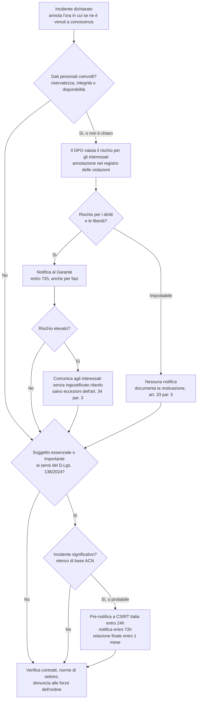

# Obblighi normativi (UE e Italia)

> **Questa non è consulenza legale.** È una sintesi dei testi, scritta perché il team di risposta si accorga per tempo che può scattare una scadenza di legge e chiami le persone giuste. Se e cosa notificare lo decide l'organizzazione con il DPO e i legali. I testi cambiano: verifica la versione vigente sulle fonti ufficiali indicate in fondo.

Uno stesso incidente può attivare più regimi contemporaneamente. Un ransomware con furto di dati in un'azienda soggetta alla NIS2 coinvolge sia il GDPR (violazione di dati personali) sia il decreto NIS (incidente significativo), con destinatari, contenuti e scadenze diversi. I termini corrono in parallelo.

## GDPR: violazione dei dati personali (Regolamento (UE) 2016/679)

Una violazione dei dati personali è una violazione di sicurezza che comporta accidentalmente o in modo illecito la distruzione, la perdita, la modifica, la divulgazione non autorizzata o l'accesso ai dati personali. Conta anche la perdita di disponibilità: i file del personale cifrati senza un backup utilizzabile sono una violazione anche se nessuno li ha sottratti.

**Art. 33: notifica all'autorità di controllo**

- Il titolare notifica la violazione all'autorità di controllo competente (in Italia il Garante per la protezione dei dati personali) **senza ingiustificato ritardo e, ove possibile, entro 72 ore** dal momento in cui ne è venuto a conoscenza, a meno che sia improbabile che la violazione presenti un rischio per i diritti e le libertà delle persone fisiche.
- Se la notifica arriva oltre le 72 ore, deve essere accompagnata dai motivi del ritardo.
- Il **responsabile del trattamento** informa il titolare senza ingiustificato ritardo dopo essere venuto a conoscenza della violazione.
- Contenuto minimo (art. 33, par. 3): natura della violazione, compresi, ove possibile, le categorie e il numero approssimativo di interessati e di registrazioni; nome e dati di contatto del DPO o di un altro punto di contatto; probabili conseguenze; misure adottate o proposte, comprese quelle per attenuare gli effetti negativi.
- Le informazioni possono essere fornite **in fasi successive** se non sono disponibili tutte insieme (art. 33, par. 4). Non aspettare la fine dell'indagine per notificare.
- Il titolare **documenta qualsiasi violazione**, notificata o no: circostanze, conseguenze, provvedimenti adottati (art. 33, par. 5). In pratica, un registro delle violazioni.
- In Italia la notifica al Garante si invia tramite l'apposita procedura telematica disponibile sul portale dei servizi online dell'Autorità.

**Art. 34: comunicazione agli interessati**

- Quando la violazione è suscettibile di presentare un **rischio elevato** per i diritti e le libertà delle persone fisiche, il titolare la comunica agli interessati **senza ingiustificato ritardo**, con un linguaggio semplice e chiaro, indicando almeno il contatto del DPO, le probabili conseguenze e le misure adottate.
- Non è richiesta se i dati sono stati resi incomprensibili (per esempio con una cifratura adeguata), se misure successive rendono non più probabile il rischio elevato, o se richiederebbe sforzi sproporzionati: in quel caso si procede con una comunicazione pubblica (art. 34, par. 3).

Le *Linee guida 9/2022 sulla notifica delle violazioni dei dati personali* dell'EDPB chiariscono quando il titolare si considera "a conoscenza" della violazione e come valutarne il rischio.

## NIS2: incidenti significativi (Direttiva (UE) 2022/2555 e D.Lgs. 138/2024)

L'Italia ha recepito la NIS2 con il decreto legislativo 4 settembre 2024, n. 138, pubblicato nella Gazzetta Ufficiale n. 230 del 1° ottobre 2024 e in vigore dal 16 ottobre 2024. L'Agenzia per la cybersicurezza nazionale (ACN) è l'Autorità nazionale competente NIS e ospita il CSIRT Italia.

**Chi**: i soggetti essenziali e importanti registrati ai sensi del decreto. Verifica se la tua organizzazione ha ricevuto da ACN la comunicazione di inserimento nell'elenco nazionale NIS.

**Quando un incidente è significativo** (art. 25, comma 4, del decreto): se ha causato o è in grado di causare una grave perturbazione operativa dei servizi o perdite finanziarie per il soggetto interessato, oppure se ha avuto o può avere ripercussioni su altre persone fisiche o giuridiche causando perdite materiali o immateriali considerevoli. La determinazione ACN 379907/2025 elenca gli incidenti significativi di base da notificare (allegato 3 per i soggetti importanti, allegato 4 per i soggetti essenziali). Secondo ACN l'obbligo di notifica si applica decorsi nove mesi dalla ricezione della comunicazione di inserimento nell'elenco, cioè da gennaio 2026 per i primi soggetti.

**Scadenze** (art. 25, comma 5, del decreto, che riprende l'art. 23, par. 4, della direttiva), tutte verso **CSIRT Italia**:

| Passaggio | Scadenza | Contenuto |
|---|---|---|
| Pre-notifica | Senza ingiustificato ritardo, e comunque **entro 24 ore** da quando si è venuti a conoscenza dell'incidente significativo | Ove possibile, se l'incidente possa derivare da atti illegittimi o malevoli e se possa avere un impatto transfrontaliero |
| Notifica dell'incidente | Senza ingiustificato ritardo, e comunque **entro 72 ore** da quando se ne è venuti a conoscenza | Aggiornamento della pre-notifica, valutazione iniziale di gravità e impatto, indicatori di compromissione se disponibili |
| Relazione intermedia | Su richiesta di CSIRT Italia | Aggiornamenti pertinenti sulla situazione |
| Relazione finale | **Entro un mese** dalla trasmissione della notifica | Descrizione dettagliata, gravità e impatto; tipo di minaccia o causa originale (root cause); misure di attenuazione adottate e in corso; impatto transfrontaliero, se noto |
| Se l'incidente è ancora in corso a quella data | Relazione mensile sui progressi, poi relazione finale entro un mese dalla conclusione della gestione dell'incidente | |

Per i prestatori di servizi fiduciari la notifica dell'incidente va inviata entro 24 ore (art. 25, comma 6).

CSIRT Italia risponde, ove possibile entro 24 ore dalla pre-notifica, con un riscontro iniziale e, su richiesta, con orientamenti sulle misure di mitigazione. Se si sospetta un reato, fornisce anche orientamenti sulla segnalazione alle autorità di contrasto (art. 25, commi 7 e 8). Se opportuno e sentito CSIRT Italia, i soggetti comunicano ai destinatari dei loro servizi gli incidenti significativi che possono ripercuotersi sulla fornitura di tali servizi (art. 25, comma 9).

Le notifiche si inviano tramite il portale di CSIRT Italia. I riferimenti agli articoli e le formulazioni qui sopra vengono dal testo pubblicato in Gazzetta Ufficiale; modifiche successive possono averne cambiato i dettagli, quindi controlla la versione vigente su Normattiva.

## Altri regimi da tenere presenti

- **DORA** (Regolamento (UE) 2022/2554) si applica alle entità finanziarie dal 17 gennaio 2025 e ha un proprio regime di segnalazione degli incidenti gravi connessi alle TIC. Se lavori in una banca, un'assicurazione o un'impresa di investimento, prevale quel playbook, che esula da questo repository.
- **Contratti**: clienti, cloud provider e assicurazioni spesso chiedono una notifica entro un termine preciso. Raccogli queste clausole in anticipo.
- **Forze dell'ordine**: estorsione, frode e accesso abusivo sono reati. La denuncia alla Polizia Postale è spesso richiesta da assicurazioni e banche (per esempio per sostenere il richiamo di un bonifico in un caso di BEC).

## Flusso decisionale

## Fonti ufficiali

- GDPR, testo integrale: <https://eur-lex.europa.eu/eli/reg/2016/679/oj>
- Garante, pagina sul data breach: <https://www.garanteprivacy.it/regolamentoue/databreach>
- Linee guida EDPB 9/2022: <https://www.edpb.europa.eu/our-work-tools/our-documents/guidelines/guidelines-92022-personal-data-breach-notification-under_en>
- Direttiva NIS2 (UE) 2022/2555: <https://eur-lex.europa.eu/eli/dir/2022/2555/oj>
- D.Lgs. 138/2024 su Normattiva: <https://www.normattiva.it/uri-res/N2Ls?urn:nir:stato:decreto.legislativo:2024-09-04;138>
- ACN, pagine NIS e specifiche di base: <https://www.acn.gov.it/portale/nis/modalita-specifiche-base>
- CSIRT Italia, notifica incidente: <https://www.csirt.gov.it/segnalazione>
