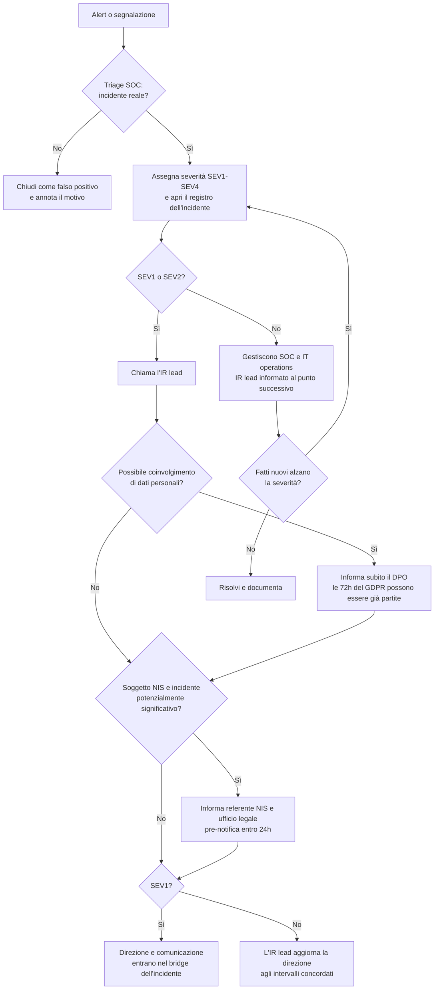

# Livelli di severità ed escalation

La severità stabilisce chi va svegliato, con quale urgenza e quanto disservizio il team di risposta può causare senza chiedere il permesso. Si assegna al triage e si rivede ogni volta che emergono fatti nuovi: un incidente che parte da una sola casella di posta violata può diventare SEV1 un'ora dopo.

I tempi di risposta indicati sotto sono **valori di esempio** per un'organizzazione di medie dimensioni con un SOC attivo 24/7. Non provengono da uno standard: definisci i tuoi e falli approvare dalla direzione prima che servano.

## Livelli di severità

| Livello | Criteri (ne basta uno) | Esempi | Tempo di risposta (esempio) | Chi è coinvolto |
|---|---|---|---|---|
| **SEV1 Critico** | Servizi critici fermi o a rischio imminente; compromissione confermata di domain admin, identity provider o backup; esfiltrazione confermata di dati personali sensibili o in grandi volumi; probabile incidente significativo ai sensi della NIS2 | Ransomware in propagazione; attaccante con ruolo Global Admin; database clienti su un leak site | Triage entro 15 min, IR lead coinvolto subito, direzione informata entro 1 h | Intero team IR, direzione, ufficio legale, DPO, comunicazione |
| **SEV2 Alto** | Un sistema importante o un processo aziendale colpito; compromissione di un singolo account privilegiato o dell'area amministrazione; possibile coinvolgimento di dati personali; DDoS in corso che degrada un servizio pubblico | BEC con un pagamento in sospeso; account amministrativo usato da un paese insolito; DDoS sul sito di e-commerce | Triage entro 30 min, IR lead entro 1 h | IR lead, SOC, IT operations, DPO o ufficio legale se serve |
| **SEV3 Medio** | Limitato a un utente o a un endpoint, nessun segno di propagazione o di accesso ai dati | Malware bloccato dopo l'esecuzione su un portatile; utente che ha inserito le credenziali su una pagina di phishing, con MFA che ha retto | Triage entro 4 h | SOC, IT operations |
| **SEV4 Basso** | Tentativo senza impatto, violazione di policy, evento informativo | Phishing segnalato e mai aperto; scansione bloccata | Giorno lavorativo successivo | SOC |

Due regole tengono il sistema onesto:

1. **Nel dubbio, sali di un livello.** Abbassare la severità dopo costa poco; accorgersi alla trentesima ora che la scadenza delle 24 ore della NIS2 è passata costa molto.
2. **La severità segue l'impatto, non la tecnica.** Un infostealer banale sul portatile del direttore finanziario non è un SEV3.

## Criteri di escalation

Esegui subito l'escalation, qualunque sia il livello attuale, quando si verifica una di queste condizioni.

| Condizione | A chi | Perché conta |
|---|---|---|
| Dati personali potenzialmente consultati, modificati, persi o divulgati | DPO (e ufficio legale) | Le 72 ore del GDPR per notificare all'autorità di controllo decorrono da quando se ne viene a conoscenza ([dettagli](regulatory.md)) |
| L'organizzazione è un soggetto essenziale o importante NIS e l'incidente può causare una grave perturbazione operativa, perdite finanziarie o danni considerevoli a terzi | Referente NIS, ufficio legale, direzione | Pre-notifica a CSIRT Italia entro 24 ore ([dettagli](regulatory.md)) |
| Identità privilegiata compromessa (domain admin, global admin cloud, amministratore dei backup, console EDR) | IR lead, responsabile della sicurezza IT | L'attaccante può disattivare le difese e il percorso di ripristino |
| Indizi di cifratura, distruzione di dati o estorsione | IR lead, direzione | SEV1 di default; decisioni su spegnimenti, assicurazione, forze dell'ordine |
| Un pagamento è in sospeso o è appena partito | Responsabile amministrazione, referente in banca | Le possibilità di richiamo calano in fretta una volta che i fondi vengono spostati |
| Stampa, clienti o partner ne sono già al corrente | Comunicazione, direzione | I messaggi devono essere coerenti e approvati |
| Sospetto di reato (estorsione, frode) | Ufficio legale, direzione | Decidere sulla denuncia alla Polizia Postale; ai soggetti NIS CSIRT Italia può dare indicazioni |
| Coinvolta una terza parte (MSP, cloud provider, fornitore) | Referente fornitori, ufficio legale | Obblighi contrattuali di notifica; potrebbero servire i loro log |
| Il contenimento fermerebbe un servizio aziendale critico | Direzione (owner del servizio) | Decisione di business, documentata con la motivazione |
| Il team non riesce a contenere l'incidente nei tempi previsti o non ha le competenze (forense, negoziazione) | IR lead, direzione | Attivare il fornitore IR a contratto o il panel dell'assicurazione |

## Percorso di escalation

## Ritmo di lavoro durante SEV1 e SEV2

- Usa un canale fuori banda (bridge telefonico, una chat non legata al tenant compromesso) se la posta o le identità possono essere compromesse.
- Fai brevi riunioni di aggiornamento a intervalli fissi, per esempio ogni 60 minuti per un SEV1. Ogni riunione si chiude con: severità attuale, cosa è cambiato, prossime azioni con i nomi, orario della riunione successiva.
- Una sola persona tiene il registro dell'incidente. Le decisioni si scrivono con chi le ha prese e perché, soprattutto quelle di *non* contenere o di *non* notificare.
